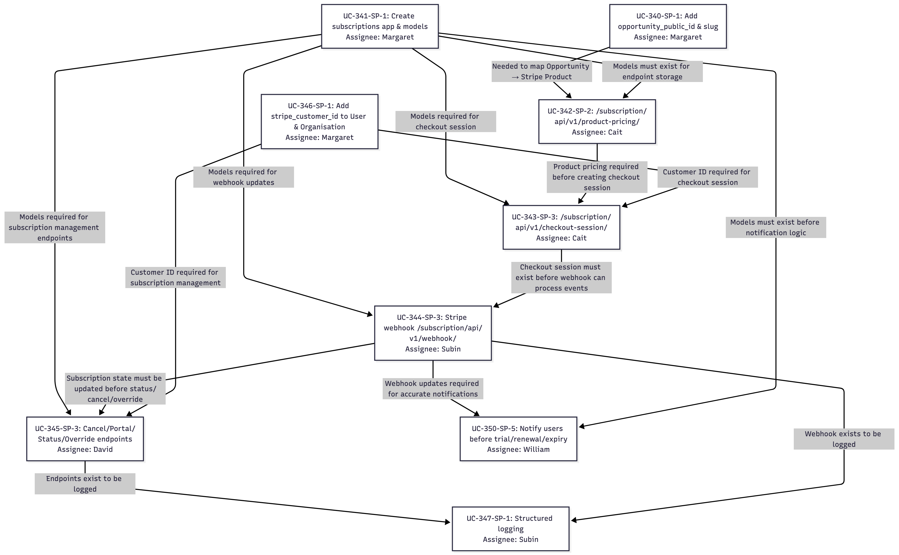

# Ceremonies

- [Ceremonies](#ceremonies)
- [Sprint 1](#sprint-1)
  - [Sprint 1 Review](#sprint-1-review)
    - [Completed Work](#completed-work)
      - [Project foundation](#project-foundation)
      - [Design and validation](#design-and-validation)
    - [Demonstration](#demonstration)
    - [Stakeholder feedback](#stakeholder-feedback)
  - [Sprint 1 Retrospective](#sprint-1-retrospective)
    - [What went well](#what-went-well)
    - [What could be improved](#what-could-be-improved)
    - [Action Items](#action-items)
    - [Next Steps](#next-steps)
    - [Additional Notes](#additional-notes)
- [Sprint 2](#sprint-2)
  - [Sprint 2 Planning](#sprint-2-planning)
    - [Sprint Backlog](#sprint-backlog)
    - [Task Breakdown](#task-breakdown)
    - [Dependencies and Risks](#dependencies-and-risks)
    - [Sprint Commitments](#sprint-commitments)
    - [Capacity Planning](#capacity-planning)
  - [Sprint 2 Review](#sprint-2-review)
    - [Completed Work](#completed-work-1)
      - [Documentation](#documentation)
    - [Demonstration](#demonstration-1)
    - [Stakeholder feedback](#stakeholder-feedback-1)
    - [Sprint Metrics and Insights](#sprint-metrics-and-insights)
  - [Sprint 2 Retrospective](#sprint-2-retrospective)
    - [What went well](#what-went-well-1)
    - [What could be improved](#what-could-be-improved-1)
    - [Action Items](#action-items-1)
    - [Next Steps:](#next-steps-1)
- [Sprint 3](#sprint-3)
  - [Sprint 3 Planning](#sprint-3-planning)
    - [Sprint backlog](#sprint-backlog-1)
    - [Task breakdown](#task-breakdown-1)
    - [Tasks allocation and indicative timeline](#tasks-allocation-and-indicative-timeline)
    - [Dependencies \& Risks](#dependencies--risks)
    - [Sprint Commitments](#sprint-commitments-1)
    - [Capacity Planning](#capacity-planning-1)
  - [Sprint 3 Review](#sprint-3-review)
    - [Completed Work](#completed-work-2)
      - [Task Completion Details](#task-completion-details)
    - [Demonstration](#demonstration-2)
    - [Stakeholder feedback](#stakeholder-feedback-2)
      - [Mid-Sprint Technical Challenges and Resolution](#mid-sprint-technical-challenges-and-resolution)
      - [Positive Feedback](#positive-feedback)
      - [Scope and Outcomes](#scope-and-outcomes)
    - [Sprint Metrics and Insights](#sprint-metrics-and-insights-1)
      - [Key Learnings](#key-learnings)
- [Sprint 4](#sprint-4)
  - [Sprint 4 Planning](#sprint-4-planning)
    - [Sprint backlog](#sprint-backlog-2)
    - [Task breakdown](#task-breakdown-2)
    - [Dependencies \& Risks](#dependencies--risks-1)
    - [Sprint Commitments](#sprint-commitments-2)
    - [Capacity Planning](#capacity-planning-2)
    - [Next steps](#next-steps-2)
# Sprint 1

- **Sprint number:** 1
- **Start date:** 2025-08-11
- **End date:** 2025-08-26
- **Sprint goal:** To establish the project foundation through stakeholder analysis, user story development, prototype design, and initial planning for employment opportunities and open enrolment features.

## Sprint 1 Review

### Completed Work
#### Project foundation
* Project background, goals and scope definition through multiple client consultations
* Stakeholder identification and persona development with motivational modelling (i.e., do-be-feel)
* User story creation with client validation, and initial story mapping
* Task breakdown with story point estimation and priority assignment

#### Design and validation
* Figma prototype development extending client's original designs, and validation with stakeholder feedback integration
* Sprint 2 planning and comprehensive user story mapping based on client priority and task dependencies 
* Documentation maintenance on GitHub wiki 

### Demonstration
The **demo format** was a more structured presentation for the user stories (see [this client meeting](meetings#client-meeting-3)), and a casual demo for the Figma prototype (see [this client meeting](meetings#client-meeting-4)), allowing the client to walkthrough and provide feedback. 

**What was demonstrated**:
* **User stories** focusing on the employment opportunities and open enrolment epics during client meeting.
* **Figma prototypes** for the student questionnaire flow, 'My Opportunities' profile page, public opportunity discovery, and dropdown components.

### Stakeholder feedback
* **User stories** 
    * Split tasks into UI/UX, frontend and backend components 
    * Merge overlapping user stories and re-estimate story points

* **Figma prototype**
    * Remove placeholder pages and public opportunities from profile view
    * Use badges for public/private opportunity differentiation in dropdown list
    * Simplify questionnaire to single-page format
    * Implement default toast messaging and refine button terminology 

## Sprint 1 Retrospective

### What went well
* Excellent client feedback and our Figma prototype was adopted as the final design  
* Successful task breakdown from requirements
* Consistent mentor meeting attendance and client communication
* Effective inter-team communication over Discord, including making use of the voice channels to help on blockers
* Proactively organising alignment calls with Team Wombat
* Successful adaption to changing client requirements (i.e., the client reassigned some of our key user stories, yet we were able to pivot and reallocate our tasks accordingly)
* Presented at the Pitch-a-thon

### What could be improved

* Implement a two-reviewer policy for all Kanban tasks. I't been decided that every task should have at least 1 other reviewer to ensure quality assurance. For example, if Person A completes a task they will move it to `In Review` and ping another available teammate on Discord for review. Only once this has been done can it be moved to `Completed`
* Improve visibility into and transparency on tasks. This includes:
    * If you have the capacity to take on a ticket not assigned to you, you need to add yourself to that ticket and notify the owner _before_ starting it. This will reduce work duplication and keep people motivated
    * If you can't complete or don't have capacity to complete a ticket assigned to you, you need to notify the team _as soon as possible_. If possible, write a task breakdown and delegate part of that task 
    * Create a thread on Discord per task for easier tracking 
* Everyone in the team should take ownership on the documentation. For sprint 2, this will look like mapping the sprint rubric documentation into sections and assign each member responsibility for one, although need to be careful on fair allocation
* Team should aim to be more proactive in updating documentation
* Standup updates and communication:
    * Team members found difficulty getting Slack push notifications, prefer Discord pings
    * We will try asynchronous standups, with reminders sent by Margaret for:
        * Monday: after mentor meeting, reflect on feedback and plan the upcoming week
        * Wednesday: standup update and peer programming
        * Saturday: standup update after optional peer programming

### Action Items
- Start 2-reviewer policy on Kanban tasks. 
    * **Assigned to**: All team members
- Create Discord threads per task for easier tracking
    * **Assigned to**: All team members
- Redistribute documentation ownership across the team [per this task](https://github.com/orgs/COMP90082-2025-sem2/projects/43?pane=issue&itemId=129377860&issue=COMP90082-2025-sem2%7CUC-Koala%7C60)
    * **Assigned to**: All team members
- Address sprint 1 feedback and update documentation
    * **Assigned to**: William
- Standup reminders (Mon, Wed, Sat)
    * **Assigned to**: Margaret

### Next Steps
- Redistribute documentation responsibilities
- Enhance quality assurance by implementing 2-reviewer policy
- Explore client codebase and start planning Sprint 2 code development tasks
- Improve standup communication with reminders

### Additional Notes
- After receiving feedback from sprint 1, our team has clear directions for improvement
- In the next sprint, we should able to have better QA practices, shared documentation responsibilities, and more effective communication

# Sprint 2 

- **Sprint number:** 2
- **Start date:** 2025-09-01
- **End date:** 2025-09-26
- **Sprint goal:** To create public opportunities with domain restrictions and a questionnaire-driven enrolment workflow for this new opportunity type. 

## Sprint 2 Planning

### Sprint Backlog
> [!IMPORTANT]
> This sprint backlog has been updated since the Sprint 1 Wiki submission, as one of our 13SP user stories was reallocated to the other team by our client to distribute the workload fairly. 
  
| ID  | User Story                                                                                                                                                             | Priority | Estimation | Assignee        | Status |
|-----|------------------------------------------------------------------------------------------------------------------------------------------------------------------------|----------|------------|-----------------|--------|
| US1 | As a student, I want to complete an employment questionnaire, so that I can receive relevant matches                                                                   | High     | 8          | William, Subin  | Done   |
| US3 | As a student or industry partner, I want to enrol into public opportunities, so that I can connect with potential matches                                              | High     | 5          | David           | Done   |
| US4 | As a student with partner university email, I want to enrol in restricted opportunities, so that I can access exclusive opportunities to my university                 | High     | 3          | Caitlin         | Done   |
| US5 | As a student with non-partner university email, I want to be informed when I cannot access restricted opportunities, so that I can understand why access is restricted | Medium   | 2          | Subin           | Done   |
| US6 | As an admin, I want to mark an opportunity as public, so that the opportunity is discoverable by students or industry partners                                         | High     | 8          | David, Margaret | Done   |

### Task Breakdown

| User Story | Task ID | Task Description                                                                                                                                                                                       | Assignee | Status |
|------------|---------|--------------------------------------------------------------------------------------------------------------------------------------------------------------------------------------------------------|----------|--------|
| US1        | T1      | Create the employment opportunity questionaire JSON                                                                                                                                                    | William  | Done   |
|            | T2      | Implement Employment Opportunity Questionnaire pages (Start, Fill, Review, Complete)                                                                                                                   | Subin    | Done   |
|            | T3      | Fill up a demo using seed_demo_data.py                                                                                                                                                                 | William  | Done   |
| US3        | T4      | Create CRUD for Opportunity Participants at /api/v2/opportunities/(int:opportunity_id)/participant. Works for both public and private opportunities. Private opportunities require a prior invitation. | David    | Done   |
| US4        | T5      | Add allowed_student_email_domains field to Opportunity model                                                                                                                                           | Caitlin  | Done   |
|            | T6      | Validate student mail domain on enrolment                                                                                                                                                              | Caitlin  | Done   |
| US5        | T7      | Restrict access to opportunities for students using non-partner university email domains                                                                                                               | Subin    | Done   |
| US6        | T8      | Introduce an "visibility" (public/private) field in the opportunity model                                                                                                                              | David    | Done   |
|            | T9      | API: Opportunities v2 split + deprecate v1 /opportunities/all                                                                                                                                          | Caitlin  | Done   |
|            | T10     | Replace api/v1/opportunities/all with api/v2/opportunities/coordinator/all                                                                                                                             | Margaret | Done   |

### Dependencies and Risks

- **Dependencies**
    - **T3** `seed_demo_data` depends on **T1** as the demo data will be informed by questionnaire response design
    - **T7** student access restrictions given non-partner university emails depends on:
        - **US4**, specifically:
            - **T5** which add the `allowed_student_email_domains` field to the `Opportunity` model
            - **T6** which validates the student’s email domain on the server during enrolment
        - Additionally, there is a dependency on Team Wombat's task for implementing `discover/<id>` for the not-enrolled state, specifically, initiating the questionnaire enrolment flow, although this can be resolved later during the sprint
    - **T2** employment opportunity questionnaire flow depends on **T7** to handle conditional routing logic based on the student's email domain (i.e., if the user has a non-partner university email, a toast is shown and the questionnaire is not displayed)
   - **T10** migrating `api/v1/opportunities/all` to `api/v2/opportunities/coordinator/all` depends on **T9** which creates this `v2` API
 - **T9** splitting the `opportunities` endpoint  depends on **T8** that introduces to the visibility field

- **Risks and mitigation strategies:**
    * Misalignment in data structures with UC-Wombat team for the discovering/filtering component: maintain consistent communication with UC-Wombat
    * Availability of mock data to test the integration of user profile: raise data request to client as early as possible
    * Integration of proposed solution into the client’s code repository: schedule code walkthrough session with client's technical lead to ensure understanding of the current code base before development.

### Sprint Commitments
* Deliver high-quality outcomes (i.e., tested, production-ready code that fully meets acceptance criteria) aligned with the sprint goal
* Create an extensible design that can accomodate future public opportunities beyond employment opportunities
* Maintain close communication with client and continually improve based on the client feedback

### Capacity Planning
In sprint 2, we are planning to finish 5 user stories, with a 26 story point estimation.

Each team member committed 15-20 hours per week across project activities, including development and testing, mentor and team meetings, lecture and workshop material completion, updating documentation and any additional research. A suggested distribution is:
* Development and testing: 50% of the effort
* Meetings and workshops: 15% of the effort
* Documentation and research: 35% of the effort

With 5 members over 4 weeks, total estimated capacity is 300-400 hours, with actual utilisation varying based on individual schedules and task complexity. 

## Sprint 2 Review

**Attendees:** 
* Stakeholders
    * Bassam Jalgha
* Team UC-Koala
    * Caitlin Alberti 
    * Margaret Xu
    * William Chen
    * Subin Seol 
    * David Sha

The detail meeting note can be view [here](meetings#client-meeting-sprint-2-review-7)

### Completed Work 

Task | User Story                                                                                                                                                           | Status    | Notes
-----|----------------------------------------------------------------------------------------------------------------------------------------------------------------------|-----------|-------------------------------------------------------------------------------------------------------
US6  | As an admin I want to mark an opportunity as public so that the opportunity is discoverable by students or organisation                                              | Done      | Merged to `develop`
US5  | As a student with non-partner university email I want to be informed when I cannot access restricted opportunities so that I can understand why access is restricted | Done      | Peer review and Bassam review complete. Awaiting merge to `develop`.
US1  | As a student or organisation I want to complete an employment questionnaire so that I can receive relevant matches                                                   | In Review | T1 and T3 complete and merged to `develop`. Awaiting final review from Maliq to merge T2 to `develop`.
US4  | As a student with a partner university email I want to enrol in restricted opportunities so I can access exclusive opportunities to my university                    | Done      | T4 merged to `develop`. Peer review and Bassam approval for T6 complete, awaiting merge to `develop`.
US3  | As a student or industry partner, I want to enrol into public opportunities, so that I can connect with potential matches                                            | Done      | Merged to `develop`

#### Documentation
* Complete [Code Review](code-reviews) and documented on Wiki
* Documentation maintenance on GitHub wiki
* Address [feedbacks](feedback-response--improvements) received from sprint 1

### Demonstration
As the stakeholder of our client meeting, Bassam, reviewed all our PR's as he merged them, the demo format was a casual demo session of the complete end-to-end workflow (i.e., user attempts to enrol in public and restricted opportunities), and a general discussion of our work. As we received frequent feedback from Bassam throughout the duration of our sprint, there was no further feedback during the demonstration on specific features (i.e., these were requested during PR reviews, all of which are now approved by him). 

### Stakeholder feedback
* The implementations went mostly without issues and followed the technical breakdown, and the backend went smoothly. Also that some of our implementations were better than expected and he was "pleasantly surprised".
* He appreciated the effort that we put into our Figma prototype, since this was the final design both teams went with.
* He appreciated proactive code quality and UI improvements beyond requirements (e.g, introducing flake8, improvements to admin with custom field overrides).

Additionally, as a technical client, he had some **suggested improvements**, which was primarily to our development practices rather than the product itself:
* We created pull requests quite late, and for next sprint to start creating pull requests early, even if they are draft pull requests. We could also consider smaller tasks breakdowns and use flags that turn off features if there is dependencies between these smaller tasks.
* To keep pull requests in draft until they have been peer reviewed, to make it clear what has undergone an internal review before he reviews it.

There are **no scope adjustments** based on this feedback, as all tasks were successfully implemented, and the next sprint will focus on an entirely different epic. 

### Sprint Metrics and Insights
* **Velocity**: 26 story points across 10 tickets
* **Burndown Chart Analysis**: The sprint burndown chart was quite flat at the start, remaining high for the first two weeks, then showed a steep decline towards the end of the sprint (i.e., flat initial progress with steep completion curve). This pattern reflected our team's approach of spending the start of the sprint on environment setup and understanding the existing codebase architecture before feature development. We can benefit from breaking down larger tickets earlier and creating more frequent pull requests in the next sprint, which will help with consistent progress and a more ideal burndown. 

(Burndown chart above excludes weekends)

* **Quality Metrics**: 
    * All new API endpoints and utility functions covered by unit tests
    * Edge cases tested for domain validation logic 
    * Minor bug on state handling for questionnaire, but resolved during development
    * Integration tests implemented for complete enrolment workflows 

## Sprint 2 Retrospective

### What went well
* All of the PRs have been approved by Bassam, and most have been merged to `develop`
* Team being proactive in organising an alignment call with Team Wombat
* Effective peer review process for pull requests
* Consistent effort to attend and improve based on feedback from mentor meetings 
* Successful peer programming sessions and knowledge sharing
* Strong client communication and appropriate pushback

### What could be improved
* Asynchronous updates did not meet the expectation of getting the team aligned, so will return to synchronous stands over Zoom 
* Limited task progress visibility affecting collaboration, where some members found it initially difficult to keep track of the updates to the task board
* Some issues with Discord thread visibility (i.e., some team members forgetting to explicitly tag others)
* Can benefit from a more structured standup format, where Scrum Master will have task board open simultaneously to review, which will improve everyone's understanding of project-wide progress and interdependencies  
* Better dependencies mitigation with Team Wombat for Sprint 3, although noting the final assignments were changed after the sprint start. So better initial estimations to avoid the situation altogether
* Use a "Date of Date" concept (i.e., period of time you take to understand the task and identify any blockers) where you raise the Excepted Completion Date by the end of this, to assist with task transparency 

### Action Items
* Create Discord role @team. Now, this role should be pinged in any opening message on a new thread
    * **Assigned to**: Caitlin, All team members
* Bring the Zoom/Discord call back with updated Monday and Thursday 8PM time slots to better fit schedules 
   * **Assigned to**: David (i.e., set up recurring meeting)
* Wednesday 8 PM optional Peer Programming session over discord
* Identify and raise blockers at the start of each sprint/when starting a task. Additionally, add EDD and ECD on GitHub, and notify the team on Discord with @team
    * **Assigned to**: All team members

### Next Steps:
- Apply lessons learned from Sprint 2 regarding early PR creation and peer review processes
- Early research into Stripe integrations for Sprint 3 development tasks

# Sprint 3

- **Sprint number:** 3
- **Start date:** 2025-09-06
- **End date:** 2025-09-24
- **Sprint goal:** To strengthen the employment opportunities through comprehensive subscription capabilities, role-based access controls, and enhanced user experience features. 

The detail meeting note can be view [here](meetings#client-meeting-sprint-3-planning-6)

## Sprint 3 Planning
The artefact for our client meeting with user story validation can be found [here](https://docs.google.com/spreadsheets/d/1C3M3NHTiiwfvMg2sIvfo7Tq3Gfuw7UXcEPoIwzdgRnY/edit?gid=129805664#gid=129805664).

### Sprint backlog  
| ID   | User Story                                                                                                                                    | Priority | Estimation | Assignee                 |
|------|-----------------------------------------------------------------------------------------------------------------------------------------------|----------|------------|--------------------------|
| US13 | As a user, I want to be offered both monthly and yearly tiers, so that I can choose the payment frequency that suits my budget and commitment | High     | 13         | Margaret, Caitlin |
| US14 | As a user, I want different subscription features based on my role, so that I only pay for relevant functionality                             | High     | 8          | Margaret, Caitlin|
| US15 | As an eligible user, I want free access to certain opportunities, so that I can participate without subscription barriers                     | Medium   |    5    | David, Subin                  |
| US16 | As a user I need to be able to cancel my subscription in which case the platform should grant me access until the subscription expires | High     | 5          | William, David          |

### Task breakdown  
| User Story | Task ID                             | Task Description                                                                             | Assignee       |  
|------------|-------------------------------------|----------------------------------------------------------------------------------------------|----------------|
| US13, US14       | UC-340                              | Add opportunity_public_id & slug to Opportunity model                                        | Margaret       |
|            | UC-341                              | Create subscriptions app & models (SubscriptionProduct, SubscriptionPrice, UserSubscription) | Margaret       |
|            | UC-346                              | Add stripe_customer_id to User & Organisation models                                         | Margaret       |
|            | UC-342                              | Create /subscription/api/v1/product-pricing/ endpoint                                        | Caitlin        |
|            | UC-343                              | Create /subscription/api/v1/checkout-session/ endpoint                                       | Caitlin        |
|            | UC-344                              | Implement Stripe webhook at /subscription/api/v1/webhook/                                    | Subin          |
| US15, US16       | UC-345                              | Create Cancel/Portal/Status/Override subscription endpoints                                  | David          |
|            | UC-347                              | Implement structured logging for subscription operations                                     | Subin          |
| US16       | UC-350 | Notify users before trial/renewal/                 | William |

### Tasks allocation and indicative timeline
 

### Dependencies & Risks  

- **Dependencies:**  
  - Client availability for feedback and validation sessions  
  - Stripe integration for subscription workflows  
  - T15 (Extend subscription model to support role-based tiers) depends on T11 and T12 since the base subscription structure must exist before role-based logic can be added
  - T20 (Display trial status and expiry in frontend) depends on T19 to ensure trial state is provided from backend 

- **Risks and mitigation strategies:**  
  - Risk: Delays in client feedback during subscription design validation
    - Mitigation: Schedule interim demos after T13 and T15 to reduce feedback loops
  - Risk: Complexity in handling role-based tiers and free trial interactions (US14 & US16 may overlap in eligibility logic)
    - Mitigation: Early prototyping of combined scenarios and test cases before sprint mid-point
  - Risk: Stripe integration may cause unexpected delays due to API or sandbox limitations
    - Mitigation: Start T11 early with a sandbox environment and prepare fallback mocks for frontend testing
  - Risk: Inter-team coordination for subscription features required in other epics (e.g., future US21 integration)
    - Mitigation: Align with external team at sprint start, share Swagger docs for subscription APIs, and plan joint integration tests

### Sprint Commitments  
- Deliver tested, production-ready code that aligns with the sprint goal  
- Implement key features of the subscription module  
- Ensure all deliverables meet their acceptance criteria  
- Maintain regular communication with the client and incorporate feedback iteratively  
- Prepare and deliver the final sprint presentation  

### Capacity Planning  
In sprint 3, we are planning to finish 4 user stories, with a 29 story point estimation for core deliverables and 8 story points for additional features pending capacity. 

Each team member committed 15-20 hours per week across project activities, including development and testing, mentor and team meetings, lecture and workshop material completion, updating documentation and any additional research. A suggested distribution is:
* Development and testing: 50% of the effort
* Meetings and workshops: 15% of the effort
* Documentation and research: 35% of the effort

## Sprint 3 Review

**Attendees:** 
* Stakeholders
    * Bassam Jalgha
* Team UC-Koala
    * Caitlin Alberti 
    * Margaret Xu
    * William Chen
    * Subin Seol 
    * David Sha

### Completed Work 

| Task   | User Story                                                                                                                                    | Status | Notes                                                               |
|--------|-----------------------------------------------------------------------------------------------------------------------------------------------|--------|---------------------------------------------------------------------|
| US13   | As a user, I want to be offered both monthly and yearly tiers, so that I can choose the payment frequency that suits my budget and commitment | Done   | All tasks completed and merged to `develop`.                        |
| US14   | As a user, I want different subscription features based on my role, so that I only pay for relevant functionality                             | Done   | All tasks completed and merged to `develop`.                        |
| US15   | As an eligible user, I want free access to certain opportunities, so that I can participate without subscription barriers                     | Done   | Completed and merged to `develop`.                                  |
| US16   | As a user I need to be able to cancel my subscription in which case the platform should grant me access until the subscription expires                      | Reviewed   | Trial functionality built into subscription models.  |

#### Task Completion Details

| Task ID | Task Description                                                                             | Status | Notes                                                                      |
|---------|----------------------------------------------------------------------------------------------|--------|----------------------------------------------------------------------------|
| UC-340  | Add opportunity_public_id & slug to Opportunity model                                        | Done   | Migration issues resolved mid-sprint. Merged to `develop`.                 |
| UC-341  | Create subscriptions app & models (SubscriptionProduct, SubscriptionPrice, UserSubscription) | Done   | Merged to `develop`.                                                       |
| UC-346  | Add stripe_customer_id to User & Organisation models                                         | Done   | Rebased onto UC-342 as per client guidance. Merged to `develop`.           |
| UC-342  | Create /subscription/api/v1/product-pricing/ endpoint                                        | Done   | Endpoint path corrected per API conventions. Merged to `develop`.          |
| UC-343  | Create /subscription/api/v1/checkout-session/ endpoint                                       | Done   | Rebased onto UC-346. Peer and client review complete. Merged to `develop`. |
| UC-344  | Implement Stripe webhook at /subscription/api/v1/webhook/                                    | Done   | Rebased onto UC-347. Opened PR to `develop` for review |
| UC-345  | Create Cancel/Portal/Status/Override subscription endpoints                                  | Done   | Merged to `develop`.                                                       |
| UC-347  | Implement structured logging for subscription operations                                     | Done   | Rebased on foundation tasks (UC-342, UC-343, UC-344, UC-345) and subject to review   |
| UC-350  | Notify users before trial/renewal/expiry                                                     | Reviewed   | Dependent on UC-344 being finalised, draft PR created.                    |

### Demonstration
The demonstration occurred through continuous integration with client review throughout the sprint. As Bassam reviewed and merged PRs incrementally, he validated the subscription infrastructure components at each stage. The team provided technical walkthroughs during PR reviews, demonstrating:
* Subscription model architecture and Stripe integration
* Product pricing and checkout session endpoints
* Webhook handling for subscription lifecycle events
* Role-based subscription features and trial period functionality
* User notification system for subscription events

### Stakeholder feedback

#### Mid-Sprint Technical Challenges and Resolution

**1. Migration and PR Base Branch Issues (21-23 October)**

Early in the sprint, the client identified critical blockers that required immediate team response:

- **Migration Error (UC-340)**
  - Client encountered migration errors blocking all subsequent PR reviews
  - **Impact**: Halted entire PR review workflow
  - **Resolution**: David diagnosed and resolved migration issues within 2.5 hours on 21 October
  - **Client Response**: "Thank you David I'll take a look in a bit" and confirmed ability to proceed with reviews
  - **Outcome**: Unblocked review process, UC-340 merged to `develop`

- **Incorrect PR Base Branches**
  - All backend PRs initially based on `develop` instead of dependent feature branches
  - Created divergent commits making rebasing impossible
  - **Client Feedback**: "I tried to rebase them myself but it is impossible, seems like the commits are divergent"
  - **Resolution**: David reorganised entire PR dependency chain on 22 October:
    - Established chain: UC-340 → UC-341 → UC-346 → UC-342 → UC-343 → UC-344 → UC-347  
  - **Outcome**: All PRs successfully rebased and merged following correct dependency order

**2. Task Prioritization and Sequencing**

- **Issue**: Foundation tasks (UC-342, UC-343, UC-345) not initially prioritized before dependent features
- **Impact**: Temporarily blocked dependent tasks (UC-344 webhook, UC-347 logger) and Team Wombat’s integration work
- **Client Directive**: "These should have been done first; they're the foundation for everything else."
- **Additional Challenge**: Duplicate subscription apps appeared on different branches requiring cleanup
- **Resolution**: 
  - Team immediately reprioritized to complete foundation tasks first
  - Caitlin delivered UC-342 PR within 24 hours of client feedback (22 October)
  - Established clear rebase chain: UC-342 ← UC-346 ← UC-343 ← UC-344 ← UC-347
  - Coordinated cleanup of duplicate work
- **Outcome**: All foundation tasks completed, enabling successful completion of dependent feature

**3. Development Process Improvements**

Client provided constructive guidance that improved team workflow:
- **Early PR Creation**: Push foundation tasks early to enable parallel work and earlier reviews
  - "If you can push UC-342 and UC-343 earlier than I can start the review early on and other branches can be rebased to them"
- **Draft Status Management**: Remove PRs from draft only after internal peer review is complete
- **Technical Standards**: 
  - Stripe version pinning: use latest stable version (==13.0.1) not flexible versions (>=6.0.0)
  - API naming conventions: follow standard format (e.g., `api/v1/subscriptions/product-pricing/`)
- **Outcome**: Team adopted all recommendations, improving PR quality and review efficiency

#### Positive Feedback

Despite mid-sprint challenges, the client provided positive recognition:

- **Responsiveness and Problem-Solving**: 
  - "Thank you for sorting this out David and being so responsive. Really appreciate it."
  - Team's rapid response to blockers (2.5 hours for migration, 24 hours for foundation tasks)
- **Code Quality**: 
  - UC-342 review: "looks good"
  - All PRs ultimately approved and merged to `develop`
- **Communication**: 
  - Effective use of Slack for urgent coordination
  - Team kept client informed throughout blocker resolution process

#### Scope and Outcomes

- **No Scope Changes**: All planned user stories and tasks completed despite mid-sprint challenges
- **Infrastructure Delivered**: Complete subscription system with Stripe integration ready for production
- **Quality Maintained**: All code passed client review despite compressed timeline due to early blockers

### Sprint Metrics and Insights

- **Velocity**: 31 story points planned and completed
- **Completion Rate**: 90% (all user stories and tasks are attempted, UC-350 needs to wait after other backeds tasks are finished)
- **Critical Blocker Resolution Times**: 
  - Migration error: ~2.5 hours (21 October 21:00 → 23:40)
  - PR dependency reorganisation: ~1.5 hours (22 October 00:23)
  - Foundation task delivery: ~24 hours from urgent request (22 October 12:23 → 23 October 15:33)
- **PR Workflow**:
  - Total PRs: 9 tasks
  - Most PRs merged to `develop`, some PRs waited for the client's review and merge, one PR waits on the other backend tasks to be merged to complete.
  - PR review cycle improved after mid-sprint reorganisation
- **Quality Metrics**: 
  - 100% client approval rate on all created and ready PRs
  - Migration testing implemented as mandatory step
  - Stripe integration configured with production-ready versioning (==13.0.1)
  - API endpoints following naming conventions
- **Team Responsiveness**: 
  - Average response time to critical issues: < 3 hours
  - All client feedback addressed within 24 hours

#### Key Learnings

1. **Foundation-First Development**: Infrastructure and core models must be completed and merged before building dependent features
2. **Migration Testing Protocol**: Always test database migrations locally before PR submission to avoid blocking team progress
3. **PR Dependency Management**: Use proper feature branch bases (not `develop`) when tasks have dependencies; establish clear dependency chains upfront
4. **Early and Incremental PR Creation**: Create PRs early (even as drafts) to:
   - Enable earlier client review and feedback
   - Allow dependent work to proceed in parallel
   - Reduce end-of-sprint merge conflicts
5. **Task Sequencing**: Complete APIs before building features that consume them (webhooks, logging, integrations)
6. **Responsive Communication**: Monitor Slack actively for client blockers; respond within business hours to maintain project momentum
7. **Coordination and Cleanup**: Prevent duplicate work across branches through better upfront planning and communication
8. **Adaptive Planning**: When priorities shift mid-sprint, reorganise quickly and communicate changes clearly to all stakeholders

# Sprint 4

- **Sprint number:** 4
- **Start date:** 2025-09-25
- **End date:** 2025-10-24
- **Sprint goal:** To complete any outstanding tasks in the sprint backlog and facilitate a smooth handover

## Sprint 4 Planning

### Sprint backlog  
| ID   | User Story                                                                                                                                           | Priority | Estimation | Assignee |
|------|------------------------------------------------------------------------------------------------------------------------------------------------------|----------|------------|----------|
| US16 | As a user, I need to be able to cancel my subscription, in which case the platform should grant me access until the subscription expires | High     | 5          | William          |
### Task breakdown  
| User Story | Task ID | Task Description                                                                             | Assignee | Story Points |
|------------|---------|----------------------------------------------------------------------------------------------|----------|--------------|
| US16       | UC-350 | Notify users before trial/renewal/                 | William | 2 |

The following is a screenshot taken from our final presentation on our 'Final Release and Handover Plan'.

### Dependencies & Risks  

- **Dependencies:**  

- UC-350 depends on UC-344 (Stripe webhook implementation) being fully merged to develop to trigger subscription event notifications
- Notification functionality requires stable `UserSubscription` model from UC-341 to track subscription status and expiry dates
- Access control logic requires subscription status checks to be implemented in authentication/authorisation layer

- **Risks and mitigation strategies:**  
- Risk: Delay in client merging UC-344 and UC-347 to develop could block UC-350 implementation
    - Mitigation: Monitor client's merge progress closely; prepare UC-350 code on feature branch for immediate rebase once dependencies are merged; coordinate with client on expected merge timeline at sprint start

- Risk: Notification timing accuracy may be affected by Stripe webhook delivery delays or failures
    - Mitigation: Implement retry logic for failed notifications; add fallback scheduled task to check expiring subscriptions daily; log all notification attempts for debugging

- Risk: Integration with already implemented function in subscription module, for example, the notification fails to trigger by fail the webhook 
  - Mitigation: Read Swagger docs for subscription APIs, maintain communication within the team.

### Sprint Commitments  
- Conduct final release and handover with the client smoothly and successfully
- Deliver tested, production-ready code that aligns with the sprint goal  
- Ensure all deliverables meet their acceptance criteria  
- Maintain regular communication with the client and incorporate any feedback  

### Capacity Planning  
In sprint 4, we plan to finish 1 user story, conduct the final release and handover fully to our client. The US16 from the last sprint will be finished after the client completes the merge of the other previous tasks into the `develop` branch.

Each team member plans to commit 5-10 hours during this sprint across project activities, including development and testing, mentor and team meetings, lecture and workshop material completion, updating documentation and any additional research. A suggested distribution is:
* Development and testing: 50% of the effort
* Meetings and workshops: 15% of the effort
* Documentation and research: 35% of the effort

### Next steps
- UC-350 is nearly complete. All planned features have been developed and implemented successfully — including the daily sweep task and automated email notifications, both of which are functioning as expected. The only remaining issue lies in testing the webhook integration, which encountered external platform (Stripe)–related difficulties. After consulting with the client, they confirmed it is acceptable to leave the task in its current state and document the progress in the PR description [UC-350 Pull Request](https://github.com/uniconnected/uniconnected-django/pull/115)