- [Code reviews](#code-reviews)
  - [PR-84](#pr-84)
    - [Summary](#summary)
    - [Feedback engagement](#feedback-engagement)
      - [AI (Copilot) Feedback](#ai-copilot-feedback)
      - [Feedback Addressed](#feedback-addressed)
      - [Lessons learned](#lessons-learned)
    - [Manual Review CheckList](#manual-review-checklist)
  - [PR-90](#pr-90)
    - [Summary](#summary-1)
    - [Feedback engagement](#feedback-engagement-1)
      - [AI (Copilot) Feedback](#ai-copilot-feedback-1)
      - [Client Feedback](#client-feedback)
      - [Feedback Addressed](#feedback-addressed-1)
      - [Lessons learned](#lessons-learned-1)
    - [Manual Review CheckList](#manual-review-checklist-1)
  - [PR-129](#pr-129)
    - [Code Review](#code-review)
      - [Summary](#summary-2)
    - [Feedback engagement](#feedback-engagement-2)
      - [AI (copilot) Feedback](#ai-copilot-feedback-2)
      - [Client Feedback](#client-feedback-1)
      - [Feedback Addressed](#feedback-addressed-2)
      - [Lessons learned (Team showed critical thinking and how they reflected on received feedback.)](#lessons-learned-team-showed-critical-thinking-and-how-they-reflected-on-received-feedback)
    - [Manual Review CheckList](#manual-review-checklist-2)
  - [PR-95](#pr-95)
    - [Summary](#summary-3)
    - [Feedback engagement](#feedback-engagement-3)
      - [AI (copilot) Feedback](#ai-copilot-feedback-3)
      - [Feedback Addressed](#feedback-addressed-3)
      - [Lessons learned (Team showed critical thinking and how they reflected on received feedback.)](#lessons-learned-team-showed-critical-thinking-and-how-they-reflected-on-received-feedback-1)
    - [Manual Review CheckList](#manual-review-checklist-3)
  - [PR-133](#pr-133)
    - [Code Review Meeting](#code-review-meeting)
  - [PR-100 & pr-102](#backend--pr-100--pr-102)
      - [Summary](#summary-4)
      - [Feedback engagement](#feedback-engagement-4)
        - [AI (Copilot) Feedback](#ai-copilot-feedback-4)
        - [Feedback Addressed](#feedback-addressed-4)
        - [Peer Review](#peer-review)
    - [Manual Review CheckList](#manual-review-checklist-4)
  - [PR-103](#backend--pr-103)
    - [Summary](#summary-5)
    - [Feedback engagement](#feedback-engagement-5)
        - [AI (Copilot) Feedback](#ai-copilot-feedback-5)
        - [Feedback Addressed](#feedback-addressed-5)
        - [Peer Review](#peer-review-1)
    - [Manual Review CheckList](#manual-review-checklist-5)
  - [PR-109](#backend--pr-109)
    - [Summary](#summary-6)
    - [Feedback engagement](#feedback-engagement-6)
        - [AI (Copilot) Feedback](#ai-copilot-feedback-6)
        - [Feedback Addressed](#feedback-addressed-6)
    - [Manual Review CheckList](#manual-review-checklist-6)
  - [PR-108 & PR-110](#backend--pr-108--pr-110)
    - [Summary](#summary-7)
    - [Feedback engagement](#feedback-engagement-7)
        - [AI (Copilot) Feedback](#ai-copilot-feedback-7)
        - [Feedback Addressed](#feedback-addressed-7)
        - [Peer Review](#peer-review-2)
    - [Manual Review CheckList](#manual-review-checklist-7)
  - [PR-105 & PR-102](#backend--pr-105--pr-102)
    - [Summary](#summary-8)
    - [Feedback engagement](#feedback-engagement-8)
        - [AI (Copilot) Feedback](#ai-copilot-feedback-8)
        - [Feedback Addressed](#feedback-addressed-8)
        - [Peer Review](#peer-review-3)
    - [Manual Review CheckList](#manual-review-checklist-8)
  - [PR-104](#backend--pr-104)
    - [Summary](#summary-9)
    - [Feedback engagement](#feedback-engagement-9)
        - [AI (Copilot) Feedback](#ai-copilot-feedback-9)
        - [Feedback Addressed](#feedback-addressed-9)
    - [Manual Review CheckList](#manual-review-checklist-9)
  - [Sprint 3 Lesson learnt](#sprint-3-lessons-learned)

# Code reviews

## [PR-84](https://github.com/uniconnected/uniconnected-django/pull/84)

- **PR Title**: feat(api): introduce visibility field to Opportunity model
- **Review Date**: 04/09/2025
- **Related User Story**: [US6](https://github.com/orgs/COMP90082-2025-sem2/projects/43/views/8?pane=issue&itemId=NaN&issue=COMP90082-2025-sem2%7CUC-Koala%7C36)
- **Repository**：uniconnected-django
- **Area (frontend/backend)**: backend
- **Organiser**: David Sha
- **Reviewers**: AI (Copilot)

### Summary

- Introduced a new visibility field to the Opportunity model to support public and private visibility.
- Updated the Django admin interface to display and filter opportunities by visibility.

| PR | Related User Story | File Name | Description | Status |
|----|---------|-----------|-------------|------------|
| [#84](https://github.com/uniconnected/uniconnected-django/pull/84) | [US6](https://github.com/orgs/COMP90082-2025-sem2/projects/43/views/8?pane=issue&itemId=NaN&issue=COMP90082-2025-sem2%7CUC-Koala%7C36) | opportunities/models.py | Introduced visibility field to Opportunity model | Completed |

## Feedback engagement

### AI (Copilot) Feedback

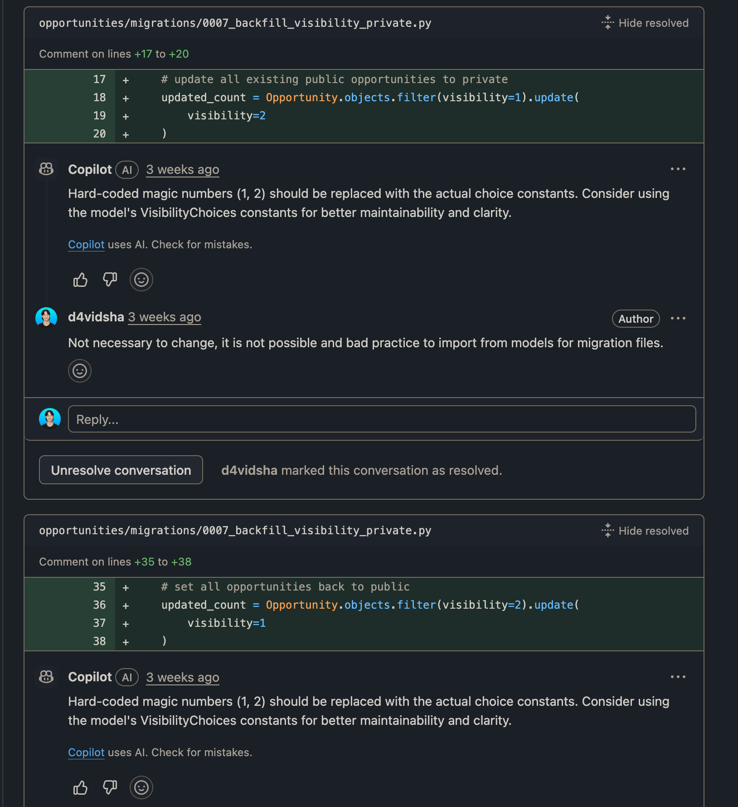

### Feedback Addressed

- I was about to think that the AI was correct with the hardcoded numbers. I decided not to change the hardcoded magic number as I realised that you shouldn't use modules within migration tasks due to the chance of making the migration non-static. I realised that it makes more sense for the migration files to not be dependent on the `VisiblityChoices` class in the model file.

| Before Review | After Review |
|----|---------|
| No changes required | No changes required |

### Lessons learned

- The AI provided a good checklist for code reviews, which I will incorporate into my future reviews. However, I also learnt to not fully trust the AI right away.

## Manual Review CheckList

1. Functionality
    - [x] The application runs without errors
    - [x] The implemented features complete the user story / meet the acceptance criteria
    - [x] Handles edge cases or invalid inputs
    - [x] No breaking changes introduces

2. Readability
    - [x] Code has clear and imformative comments
    - [x] Consistent with naming convertions
    - [x] Proper code structure and indentation
    - [x] No redundant code (instead use reusable functions)
    - [x] The code files are put into correct places to maintain a good structure of the codebase

3. Error Handling
    - [x] The input of the validation is check (null input is invalid if there is input)
    - [x] Appropriate error messages/status codes are returned/displayed
    - [x] All the errors are handled properly (will not cause the break down of the system)

4. Documentation
    - [x] The PR has clear message about what is implemented
    - [x] The status of the task board is updated

5. Testing
    - [x] Unit tested are added or updated
    - [x] Edge cases are convered in the tests
    - [x] All the tests return the expected results

## [PR-90](https://github.com/uniconnected/uniconnected-django/pull/90)

- **PR Title**: feat(api): implement /v2/opportunities/<id>/participant endpoint
- **Review Date**: 18/09/2025
- **Related User Story**: [US3](https://github.com/orgs/COMP90082-2025-sem2/projects/43/views/8?pane=issue&itemId=126616317&issue=COMP90082-2025-sem2%7CUC-Koala%7C37)
- **Repository**：uniconnected-django
- **Area (frontend/backend)**: backend
- **Organiser**: David Sha
- **Reviewers**: AI (Copilot), Bassam

### Summary

- Implemented the /v2/opportunities/<id>/participant endpoint with full CRUD functionality

| PR | Related User Story | File Name | Description | Status |
|----|---------|-------------|------------|------------|
| #90 | [US3](https://github.com/orgs/COMP90082-2025-sem2/projects/43/views/8?pane=issue&itemId=126616317&issue=COMP90082-2025-sem2%7CUC-Koala%7C37) | opportunities/api/v2/views.py | Implemented OpportunityParticipantView with GET, POST, PATCH, DELETE methods | Completed |

## Feedback engagement

### AI (Copilot) Feedback

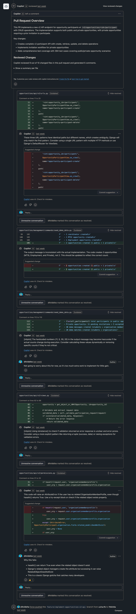

### Client Feedback

### Feedback Addressed

- Copilot was able to provide a very good point that the URL patterns have identical paths. I originally thought that they must be different, but after observing the AI's response, I can see how we don't need them.
- There was also a magic number that had incorrect values and Copilot was able to point that out.
- The AI suggested removing the magic numbers altogether as well, but I critically thought that there is too much extra work for too little gain. That is why I said I won't worry about this for now. It was also a good idea to not worry, because Bassam said later that we shouldn't update the `seed_demo_data.py` file.
- The AI also suggested to not use `isinstance()` which is a Python built-in function. I agree that we shouldn't guess the type of the object, so we made it so that there are explicit tuple of `(success, result)` to indicate whether the validation was successful or not. This is a good idea also because it makes the code more readable and easier to understand.
- The AI also suggested to stop using the `hasattr()` function, which I found to be a classic Django "gotcha". I found information online to verify that it was correct and so I agreed with the AI's suggestion.
- Bassam gave mostly good feedback. As he is the subject matter expert, I agreed with most of his suggestions. This included a suggestion to fix a mistake we made in the task description, which was a good catch.
- He also suggested to remove permissions that I created and I agreed with that as well, because authenticated users were all that was needed according to Bassam.
- He also mentioned to remove the `seed_demo_data.py` changes, which I agreed with because it was not part of the task and would have been extra work for little gain.
- Lastly, the only change I pushed back on was the suggestion to change the swagger schema file. Since it wasn't part of the task requirements, I pushed back and stated that we can do it in a future PR instead, so that we can make sure we deliver in time.

| Before Review | After Review |
|----|---------|
| [before-review-pr90.log](resources/before-review-pr90.log) | [after-review-pr90.log](resources/after-review-pr90.log) |

### Lessons learned

- The AI was quite reliable in identifying nitpicks that I overlooked, such as the magic numbers and the identical URL patterns.
- I also learnt to push back on suggestions that are not part of the task requirements, as I realised that scope creep can lead to delays in delivery. I realised that I was about to accept the suggestion to change the swagger schema file too, but since it was such an open problem, it wasn't suitable for this PR. I learnt to critically think about the suggestions and only accept those that are relevant and beneficial to the task at hand.

## Manual Review CheckList

1. Functionality
    - [x] The application runs without errors
    - [x] The implemented features complete the user story / meet the acceptance criteria
    - [x] Handles edge cases or invalid inputs
    - [x] No breaking changes introduces

2. Readability
    - [x] Code has clear and imformative comments
    - [x] Consistent with naming convertions
    - [x] Proper code structure and indentation
    - [x] No redundant code (instead use reusable functions)
    - [x] The code files are put into correct places to maintain a good structure of the codebase

3. Error Handling
    - [x] The input of the validation is check (null input is invalid if there is input)
    - [x] Appropriate error messages/status codes are returned/displayed
    - [x] All the errors are handled properly (will not cause the break down of the system)

4. Documentation
    - [x] The PR has clear message about what is implemented
    - [x] The status of the task board is updated

5. Testing
    - [x] Unit tested are added or updated
    - [x] Edge cases are convered in the tests
    - [x] All the tests return the expected results

## [PR-129](https://github.com/uniconnected/uniconnected2-frontend/pull/129)

- **PR Title / ID**: UC 308 – Add access control for non-partner university student from joining opportunity
- **Review Date**: 23/09/2025
- **Related User Story(could be multiple)**: [US5](https://github.com/orgs/COMP90082-2025-sem2/projects/43/views/5?pane=issue&itemId=126616566&issue=COMP90082-2025-sem2%7CUC-Koala%7C40)
- **Repository**： uniconnected2-frontend
- **Area (frontend/backend)**: frontend
- **Organiser**: Subin Seol
- **Reviewers**: AI (Copilot), Bassam (client)

## Code Review

### Summary:
- Add allowed_student_email_domains field to Opportunity interface in types/invite.ts
- Update InviteCard component with domain eligibility checking
- Implement warning toast notification with Chakra UI integration

| PR | Related User Story | File Name | Description | Status |
|----|---------|-------------|------------|------------|
|#129 | UC-308 | `src/utils/domainEligibility.ts` | Added utility functions to extract email domain and check eligibility | Completed |
|#129 | UC-308 | `src/app/(protected)/discover/page.tsx` | Integrated domain eligibility check in enroll flow with toast warnings; refactored `handleEnroll` | Completed |

## Feedback engagement

### AI (copilot) Feedback
- Suggested stricter email parsing (regex vs validator library).  
- Highlighted ambiguity when handling malformed or empty email domains.  
- Warned against unsafe subdomain matching (`maliciousuniversity.edu` vs `university.edu`).  
- Recommended clearer, more generic error messages about domain restrictions.  

### Client Feedback
- Emphasised that the access control must be limited to enrollment through the Discover page, not invites. Eligibility checks for invited users should not be enforced at this stage.  
- Recommended consistency in toast notifications, requesting to use the existing `react-toastify` library rather than introducing a new `Toaster` component.  
- Requested removal of the `validator` dependency, as the project already uses Yup for validation. Suggested aligning validation to Yup functions for consistency.  
- Flagged integration issues with UC-326-2 branch, and asked to fully rebase to ensure the enroll button logic is synced.  
- Pointed out a state management issue where the enroll button did not update when a user was already enrolled but domain restrictions conflicted, recommending deeper investigation into `useDiscovery`.  

### Feedback Addressed

(What action has been taken)
- Rebased and integrated with UC-326-2 branch.  
- Updated domain validation (removed `validator`, aligned with Yup).  
- Replaced Toaster with `react-toastify` for consistency.  
- Restricted eligibility check only to Discover page (not invites).  
- State management issue flagged by Client was acknowledged but not resolved in this PR.  
  - It was intentionally deferred and handled in another task, as a pre-step for [PR#133](https://github.com/uniconnected/uniconnected2-frontend/pull/133), which directly depended on this PR’s implementation.

| Before Review | After Review |
|----|---------|
| Used `validator` library | Replaced with Yup for validation consistency |
| Toaster component introduced | Reverted to `react-toastify` |
| Eligibility check applied to all enrollments | Limited to Discover page only |
| Enrollment flow not synced with UC-326-2 | Rebased and aligned with enroll button |
| Enroll button not updating correctly | Deferred fix to PR#133 (dependency task) |

### Lessons learned (Team showed critical thinking and how they reflected on received feedback.)
- Copilot feedback helped tighten input validation and detect subtle edge cases in domain parsing.  
- Bassam’s feedback clarified scope boundaries (only Discover enrollments), ensuring the feature did not overreach.  
- Consistency in dependencies (`react-toastify`, Yup) prevents technical debt and fragmentation.  
- Importance of rebasing early with dependent branches to avoid misalignment.  
- **Note:** Due to rebasing and merging with another team’s branch, Copilot pointed out errors and improvement suggestions in code sections owned by that other team. These were acknowledged but deliberately not addressed, as they fell outside this PR’s ownership.

## Manual Review CheckList

1. Functionality
    - [x] The application runs without errors
    - [x] The implemented features complete the user story / meet the acceptance criteria
    - [x] Handles edge cases or invalid inputs
    - [x] No breaking changes introduces

2. Readability
    - [x] Code has clear and imformative comments
    - [x] Consistent with naming convertions
    - [x] Proper code structure and indentation
    - [x] No redundant code (instead use reusable functions)
    - [x] The code files are put into correct places to maintain a good structure of the codebase

3. Error Handling
    - [x] The input of the validation is check (null input is invalid if there is input)
    - [x] Appropriate error messages/status codes are returned/displayed
    - [x] All the errors are handled properly (will not cause the break down of the system)

4. Documentation
    - [x] The PR has clear message about what is implemented
    - [x] The status of the task board is updated

5. Testing
    - [x] Unit tested are added or updated
    - [x] Edge cases are convered in the tests
    - [x] All the tests return the expected results

## [PR-95](https://github.com/uniconnected/uniconnected-django/pull/95)

- **Review Date**: Sep 22nd
- **Related User Story(could be multiple)**: US6
- **Area (frontend/backend)** backend

### Summary:
- Identified hardcoded industry category lists in seed_demo_data.py that impact maintainability
- AI (Copilot) suggested extracting long lists into constants or configuration files
- I evaluated the suggestion and decided to implement a configuration-based approach

| PR | Related User Story | File Name | Description | Status |
|95|US6|opportunities/management/commands/seed_demo_data.py|Extract hardcoded industry categories to improve maintainability|Completed|
|95|US6|New configuration file for industry categories|New configuration file for industry categories|Completed|

### AI (copilot) Feedback

### Feedback Addressed

(What action has been taken)
- Accepted Copilot's core recommendation to extract hardcoded lists
- Enhanced suggestion by planning configuration file approach instead of simple constants

### Lessons learned (Team showed critical thinking and how they reflected on received feedback.)

### Maunal Review CheckList

1. Functionality
    - [X] The application runs without errors
    - [X] The implemented features complete the user story / meet the acceptance criteria
    - [X] Handles edge cases or invalid inputs
    - [X] No breaking changes introduces

2. Readability
    - [X] Code has clear and imformative comments
    - [X] Consistent with naming convertions
    - [X] Proper code structure and indentation
    - [X] No redundant code (instead use reusable functions)
    - [X] The code files are put into correct places to maintain a good structure of the codebase

3. Error Handling
    - [X] The input of the validation is check (null input is invalid if there is input)
    - [X] Appropriate error messages/status codes are returned/displayed
    - [X] All the errors are handled properly (will not cause the break down of the system)

4. Documentation
    - [X] The PR has clear message about what is implemented
    - [X] The status of the task board is updated

5. Testing
    - [X] Unit tested are added or updated
    - [X] Edge cases are convered in the tests
    - [X] All the tests return the expected results

## [PR-133](https://github.com/uniconnected/uniconnected2-frontend/pull/133)
- **PR Title/ID**: UC 305: Implement Employment Opportunity Questionnaire pages
- **Review Date**: 25/09/2025
- **Related User Story**: US1
- **Repository**：uniconnected2-frontend
- **Artefacts to be reviewed** 
    * `src/hooks/useQuestionnaireAnswers.ts`
    * `src/app/opportunities/fill/page.tsx`
    * `src/app/opportunities/review/page.tsx`
    * `src/app/opportunities/complete/page.tsx`
    * `src/components/questionnaire/QuestionnaireForm.tsx`
- **What to be reviewed:** The complete questionnaire workflow implementation, including state management, domain validation logic, form handling, and user experience flow
- **Organiser**: Caitlin 
- **Reviewers**: Caitlin, William

## Code Review Meeting 

| Item | Artefact | Location | Severity | Type | Defect Category | Description | Fixed by author? 
|----|---------|-------------|------|-----|----------|----------------|-----|
1 | `components/questionnaire/QuestionnaireForm.tsx` | `FieldRenderer` mapping | Medium | Issue | Logic Defects (Data) | Dropdown components use field slugs instead of display names, causing poor UX | Yes
2 | `components/questionnaire/QuestionnaireForm.tsx` | Form initialisation logic | High | Issue | Logic Defects (State) | Form doesn't pre-populate when navigating back from review page (state management issue) | Yes
3 | `components/questionnaire/QuestionnaireForm.tsx` | `handleFieldUnregistered` function | Trivial | Improvement | Standard Defects (Code Style) | Unused restructured variable, could use an underscore instead to show intentional | No 
4 | `components/questionnaire/QuestionnaireForm.tsx` | `defaultValues` | Trivial | Improvement | Standard Defects (Code Organisation) | The `useMemo` contains complex nested switch logic that could move to e.g., `getDefaultValue` for readability | No

* Number of severe/critical errors: 0
* Number of high errors: 1
* Number of medium errors: 1
* Number of low errors: 0
* Number of trivial errors: 2
* Total inspection time: 30 minutes

Interesting, this PR underwent multiple rounds of AI-assisted code review, however manual review was still essentially to identify context-specific issues like form statement management and UX concerns that require more domain knowledge. 

## Backend : [PR-100](https://github.com/uniconnected/uniconnected-django/pull/100) & [PR-102](https://github.com/uniconnected/uniconnected-django/pull/102)

- **PR Title / ID**:    
  - UC-340: Add opportunity_public_id & slug to Opportunity model  
  - UC-341: Create subscriptions app & models 
- **Review Date**: 23/10/2025
- **Related User Story**: [US13](https://github.com/orgs/COMP90082-2025-sem2/projects/43/views/1?pane=issue&itemId=131054761&issue=COMP90082-2025-sem2%7CUC-Koala%7C68)
- **Repository**： uniconnected2-django
- **Area (frontend/backend)**: backend
- **Organiser**: Margrate
- **Reviewers**: AI (Copilot), Bassam (client), David

## Code Review

### Summary:
- Adding extra fields to the Opportunity model, update seed_demo_data to align with the model.
- Implements a new Django subscriptions app with Stripe integration to handle payment subscriptions and manual access overrides for opportunity participants

| PR | Related User Story | File Name | Description | Status |
|----|---------|-------------|------------|------------|
|#100 | UC-340 | `opportunities/models.py` | Added `public_id (UUID)` and `slug` fields to Opportunity model for API and URL consistency | Completed |
| |  | `opportunities/migrations/0009_opportunity_public_id_opportunity_slug.py`, `opportunities/tests/test_migration_0009.py` | Created migration with backfill logic, and added migration test for data integrity validation | Completed |
||  | `opportunities/migrations/0009_opportunity_public_id_opportunity_slug.py`, `opportunities/tests/test_migration_0009.py` | Updated demo data seeding with hardcoded UUIDs and slugs for created opportunities | Completed |
|#102 | UC-341 | `subscriptions/models.py` | Implemented new `Subscription` and `AccessOverride` models with Stripe integration | Completed |
| |  | `subscriptions/admin.py` ,`subscriptions/apps.py`, `subscriptions/migrations/*`| Added Django admin interfaces, database migrations, and app registration | Completed |

## Feedback engagement

### AI (copilot) Feedback

### Client Feedback
- The migration from the UC-340 does not work and need to be fixed.
- The branch needs to be rebased correctly before merging to the `develop` branch.

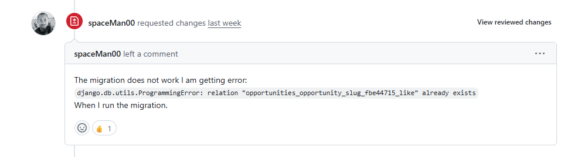

### Feedback Addressed
- Rebased the branches to Head of the develop branch
- Address the AI feedback on UC-340, abd fixing the error.

### Peer review

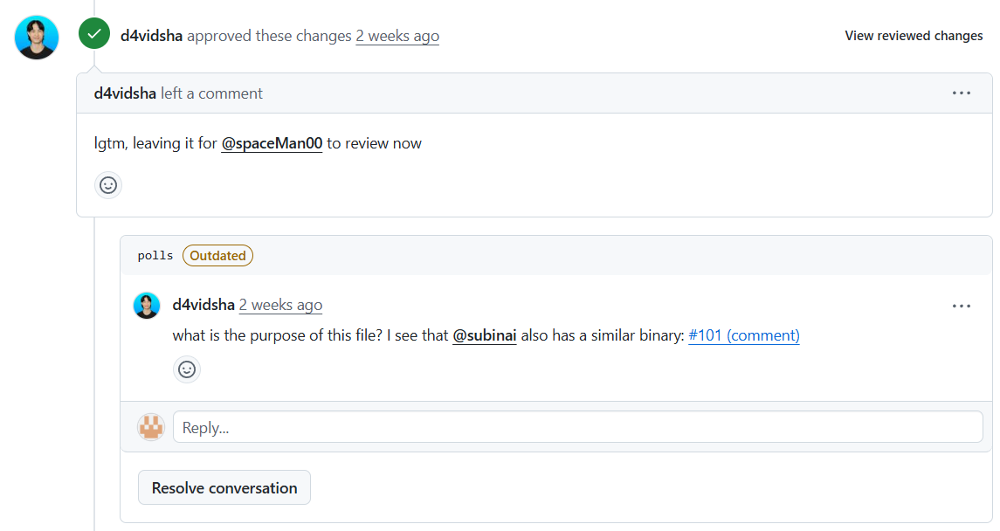
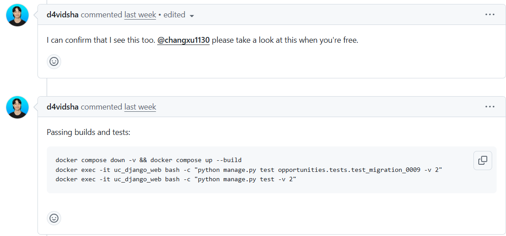

## Manual Review CheckList

1. Functionality
    - [x] The application runs without errors
    - [x] The implemented features complete the user story / meet the acceptance criteria
    - [x] Handles edge cases or invalid inputs
    - [x] No breaking changes introduces

2. Readability
    - [x] Code has clear and imformative comments
    - [x] Consistent with naming convertions
    - [x] Proper code structure and indentation
    - [x] No redundant code (instead use reusable functions)
    - [x] The code files are put into correct places to maintain a good structure of the codebase

3. Error Handling
    - [x] The input of the validation is check (null input is invalid if there is input)
    - [x] Appropriate error messages/status codes are returned/displayed
    - [x] All the errors are handled properly (will not cause the break down of the system)

4. Documentation
    - [x] The PR has clear message about what is implemented
    - [x] The status of the task board is updated

5. Testing
    - [x] Unit tested are added or updated
    - [x] Edge cases are convered in the tests
    - [x] All the tests return the expected results

## Backend : [PR-103](https://github.com/uniconnected/uniconnected-django/pull/103)

- **PR Title / ID**:    
  - UC-346: Add stripe_customer_id to User & Organisation and helper to resolve/create customer  
- **Review Date**: 23/10/2025
- **Related User Story**: [US13](https://github.com/orgs/COMP90082-2025-sem2/projects/43/views/1?pane=issue&itemId=131054761&issue=COMP90082-2025-sem2%7CUC-Koala%7C68)
- **Repository**： uniconnected2-django
- **Area (frontend/backend)**: backend
- **Organiser**: Margrate
- **Reviewers**: AI (Copilot), Bassam (client), Caitlin

## Code Review

### Summary:
This pr enhances the Stripe integration support by adding `stripe_customer_id` field, create new migration and helper function to get_or_create Stripe customer IDs.

| PR | Related User Story | File Name | Description | Status |
|----|---------|-------------|------------|------------|
|#136 | UC-346 | `uniconnected_accounts/models.py` | Added `stripe_customer_id` CharField to both User and Organisation models | Completed |
| |  | `uniconnected_accounts/migrations/0021_organisation_stripe_customer_id_and_more.py` | Added migration with nullable fields for backward compatibility | Completed |
||  | `opportunities/migrations/0009_opportunity_public_id_opportunity_slug.py`, `opportunities/tests/test_migration_0009.py` | Updated demo data seeding with hardcoded UUIDs and slugs for created opportunities | Completed |
||  | `uniconnected_accounts/admin.py` | Updated admin interface with read-only `stripe_customer_id` display and dedicated Billing section | Completed |
| |  | `subscriptions/services.py`| Implemented `get_or_create_customer_id` helper for Stripe integration | Completed |

## Feedback engagement

### AI (copilot) Feedback
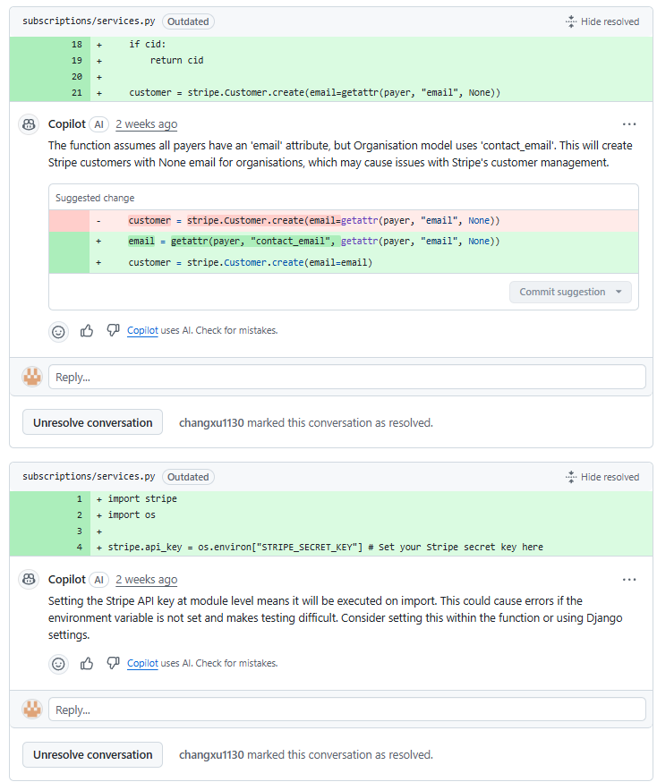
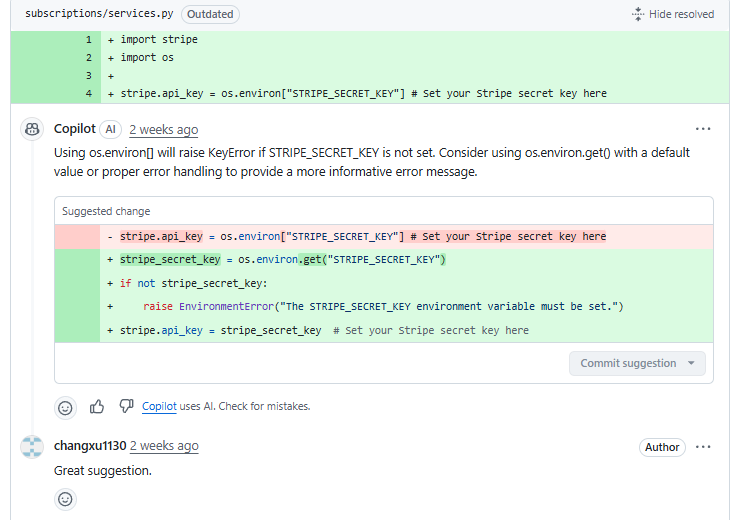

### Client Feedback
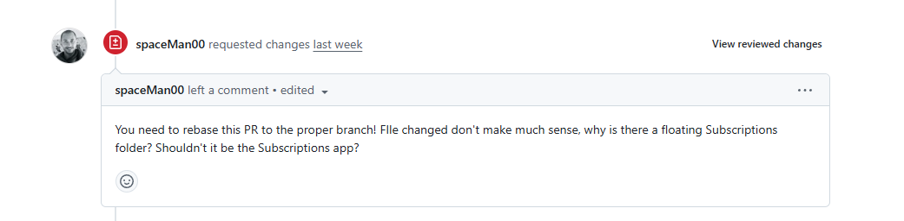
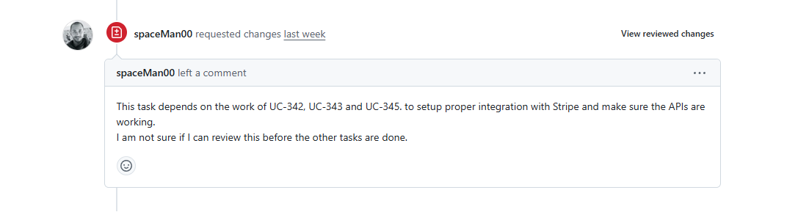

### Peer Review
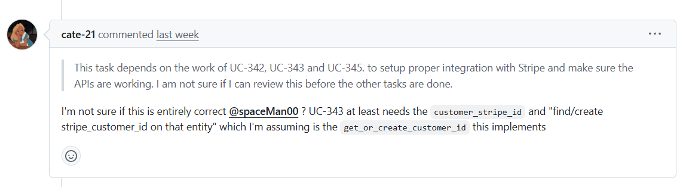
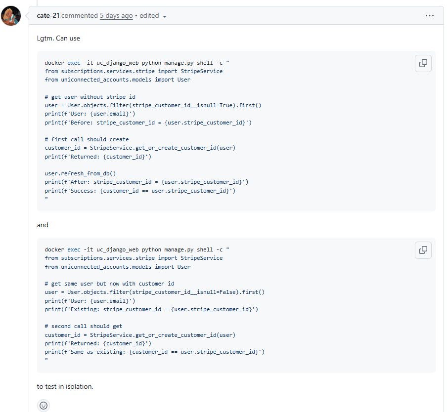

### Feedback Addressed

- According to the receive feedback, rebase this branch properly
- Address all the AI feedback.

## Manual Review CheckList

1. Functionality
    - [x] The application runs without errors
    - [x] The implemented features complete the user story / meet the acceptance criteria
    - [x] Handles edge cases or invalid inputs
    - [x] No breaking changes introduces

2. Readability
    - [x] Code has clear and imformative comments
    - [x] Consistent with naming convertions
    - [x] Proper code structure and indentation
    - [x] No redundant code (instead use reusable functions)
    - [x] The code files are put into correct places to maintain a good structure of the codebase

3. Error Handling
    - [x] The input of the validation is check (null input is invalid if there is input)
    - [x] Appropriate error messages/status codes are returned/displayed
    - [x] All the errors are handled properly (will not cause the break down of the system)

4. Documentation
    - [x] The PR has clear message about what is implemented
    - [x] The status of the task board is updated

5. Testing
    - [x] Unit tested are added or updated
    - [x] Edge cases are convered in the tests
    - [x] All the tests return the expected results

## Backend : [PR-109](https://github.com/uniconnected/uniconnected-django/pull/109) 

- **PR Title / ID**:    
  - UC-345: Implement cancel, portal, status, and access-override endpoints 
- **Review Date**: 24/10/2025
- **Related User Story**: [US16](https://github.com/orgs/COMP90082-2025-sem2/projects/43/views/1?pane=issue&itemId=131055071&issue=COMP90082-2025-sem2%7CUC-Koala%7C71)
- **Repository**： uniconnected2-django
- **Area (frontend/backend)**: backend
- **Organiser**: David
- **Reviewers**: AI (Copilot), Bassam (client), Subin

## Code Review

### Summary:
This pr created four new subscription management API endpoints to support backend testing without dependency.   
These endpoints cover subscription cancellation, billing portal session creation, status checking, and access override management

| PR | Related User Story | File Name | Description | Status |
|----|---------|-------------|------------|------------|
|#109 | UC-345 | `subscriptions/services/stripe.py` | Added `cancel_subscription` and `create_billing_portal_session` methods for StripeService integration | Completed |
| |  | `subscriptions/services/access.py` | Implemented new `AccessService` for evaluating subscription and override permissions | Completed |
||  | `subscriptions/api/v1/views.py` | Added four new API endpoints: cancel, billing portal, status, and access override | Completed |
| |  | `subscriptions/api/v1/urls.py` | Defined URL routing for all new endpoints | Completed |
| |  | `subscriptions/api/v1/serializers.py`| Added request/response serializers for endpoint validation | Completed |
| |  | `subscriptions/api/v1/schemas.py`| Defined OpenAPI schemas for new endpoints | Completed |
| |  | `subscriptions/tests/test_subscription_apis.py`| Test suite covering success, error, and permission edge cases | Completed |

## Feedback engagement

### AI (Copilot) Feedback
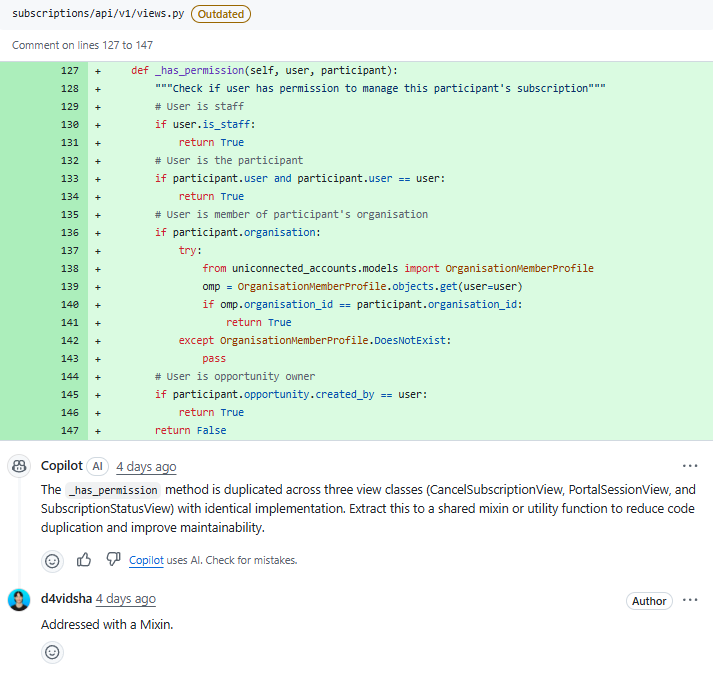
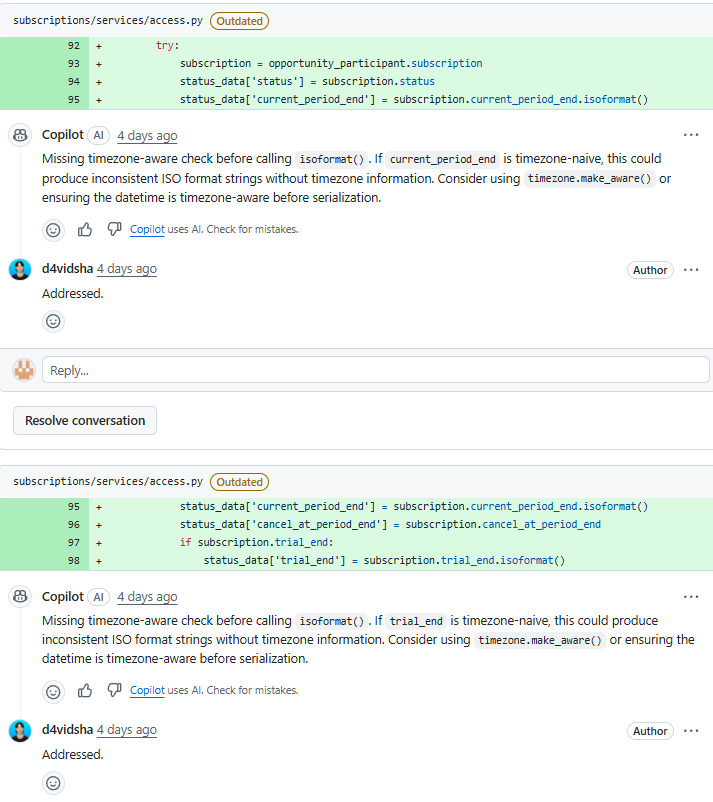

### Client Feedback
The client seems happy with this pr, approve the PR merged with no feedback.

### Feedback Addressed
- Address the AI feedback and modify the code.

## Manual Review CheckList

1. Functionality
    - [x] The application runs without errors
    - [x] The implemented features complete the user story / meet the acceptance criteria
    - [x] Handles edge cases or invalid inputs
    - [x] No breaking changes introduces

2. Readability
    - [x] Code has clear and imformative comments
    - [x] Consistent with naming convertions
    - [x] Proper code structure and indentation
    - [x] No redundant code (instead use reusable functions)
    - [x] The code files are put into correct places to maintain a good structure of the codebase

3. Error Handling
    - [x] The input of the validation is check (null input is invalid if there is input)
    - [x] Appropriate error messages/status codes are returned/displayed
    - [x] All the errors are handled properly (will not cause the break down of the system)

4. Documentation
    - [x] The PR has clear message about what is implemented
    - [x] The status of the task board is updated

5. Testing
    - [x] Unit tested are added or updated
    - [x] Edge cases are convered in the tests
    - [x] All the tests return the expected results

## Backend : [PR-108](https://github.com/uniconnected/uniconnected-django/pull/108) & [PR-110](https://github.com/uniconnected/uniconnected-django/pull/110)

- **PR Title / ID**:    
  - UC-342: Add subscriptions product pricing endpoint
  - UC-343: Add /subscription/api/v1/checkout-session/ endpoint
- **Review Date**: 24/10/2025
- **Related User Story**: [US13](https://github.com/orgs/COMP90082-2025-sem2/projects/43/views/1?pane=issue&itemId=131054761&issue=COMP90082-2025-sem2%7CUC-Koala%7C68)
- **Repository**： uniconnected2-django
- **Area (frontend/backend)**: backend
- **Organiser**: Caitlin
- **Reviewers**: AI (Copilot), Bassam (client), David, William

## Code Review

### Summary:

These two PRs introduce key Stripe API endpoints. UC-342 adds the product-pricing endpoint with caching to optimize Stripe API calls, and UC-343 introduces the checkout-session endpoint, enabling subscription creation with trial support.

| PR | Related User Story | File Name | Description | Status |
|----|---------|-------------|------------|------------|
|#108 | UC-342 | `uniconnected_backend/urls.py` | Registered subscription API routes | Completed |
| |  | `uniconnected_backend/settings.py` | Added Stripe configuration and in-memory cache setup | Completed |
||  | `subscriptions/services/stripe.py` | Implemented `StripeService` with product pricing retrieval and caching logic | Completed |
||  | `subscriptions/api/v1/views.py` | Added `ProductPricingView` endpoint with parameter validation | Completed |
| |  | `subscriptions/api/v1/urls.py`| Defined route mapping for product-pricing endpoint | Completed |
| |  | `subscriptions/api/v1/serializers.py`| Defined serializers for request/response validation | Completed |
| |  | `subscriptions/api/v1/schemas.py`| Added OpenAPI schema definitions for documentation | Completed |
|#110 | UC-343 | `uniconnected_backend/settings.py` | Added billing success and cancel URL configuration | Completed |
| |  | `uniconnected_backend/settings.py` | Added Stripe configuration and in-memory cache setup | Completed |
||  | `subscriptions/services/stripe.py` | Implemented `create_checkout_session` with trial period support | Completed |
||  | `subscriptions/api/v1/views.py` | Added `CheckoutSessionView` with request validation and Stripe error handling | Completed |
| |  | `subscriptions/api/v1/urls.py`| Registered `/checkout-session/` API route | Completed |
| |  | `subscriptions/api/v1/serializers.py`| Implemented serializers for checkout session input/output validation | Completed |

## Feedback engagement
### AI (copilot) Feedback

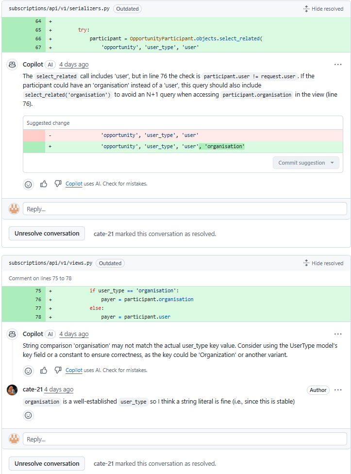
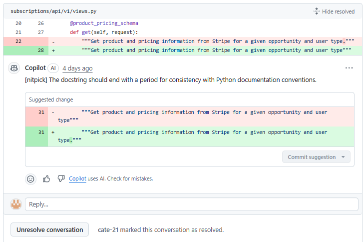
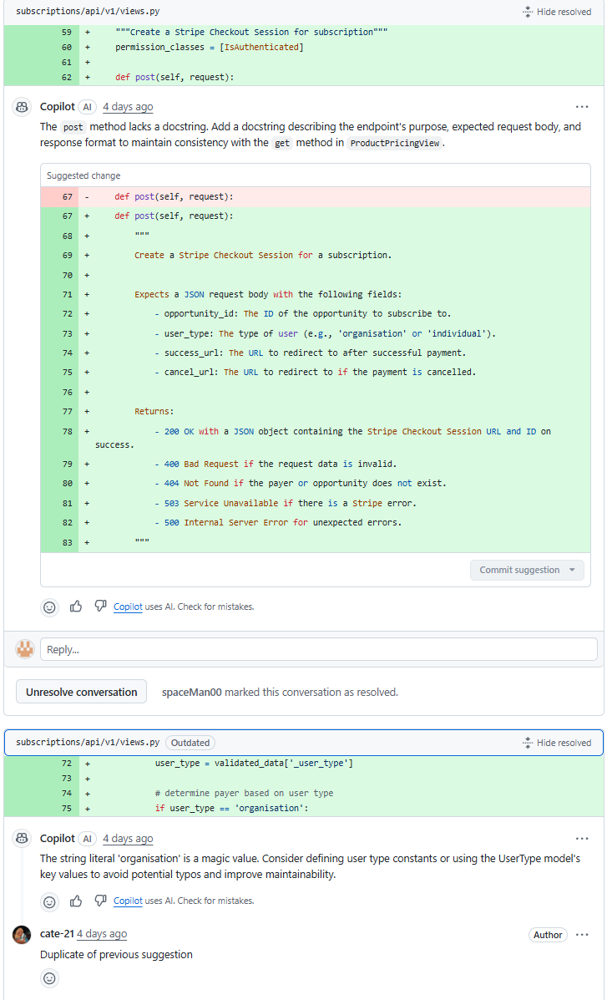
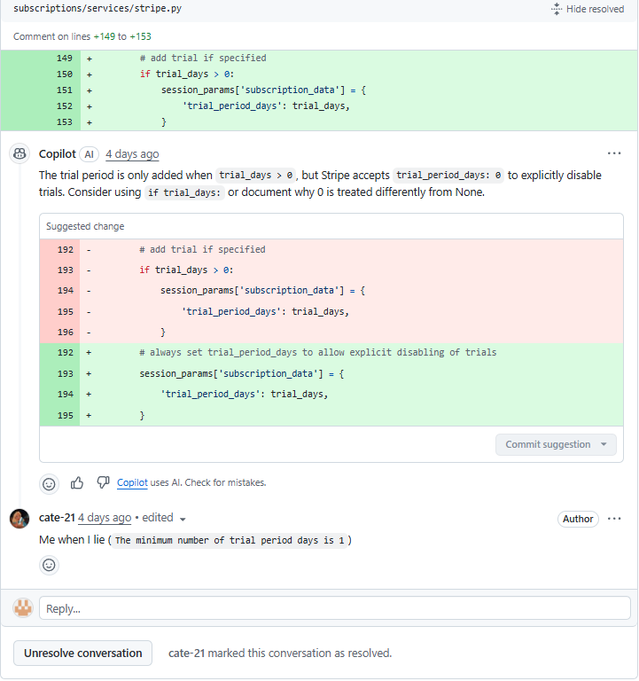

### Client Feedback
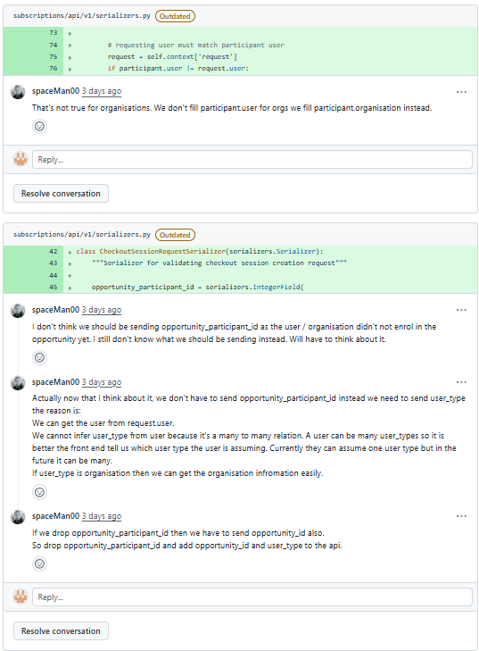
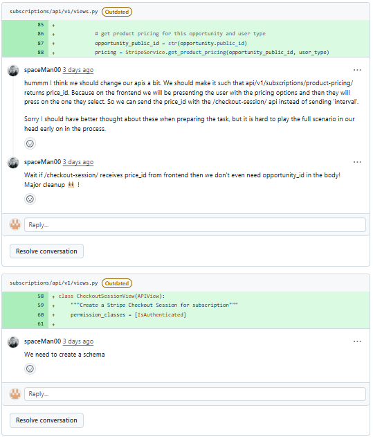
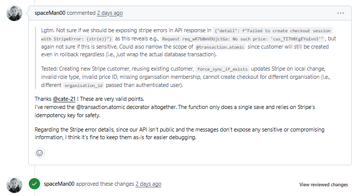

### Peer Review
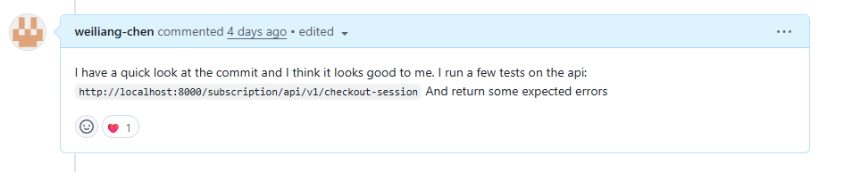

### Feedback Addressed

- Addressed some of the AI feedback, noting an incorrect suggestion: some feedback are not required to be addressed or duplicated.
- Added docstring to describe the endpoint's purpose.

## Manual Review CheckList

1. Functionality
    - [x] The application runs without errors
    - [x] The implemented features complete the user story / meet the acceptance criteria
    - [x] Handles edge cases or invalid inputs
    - [x] No breaking changes introduces

2. Readability
    - [x] Code has clear and imformative comments
    - [x] Consistent with naming convertions
    - [x] Proper code structure and indentation
    - [x] No redundant code (instead use reusable functions)
    - [x] The code files are put into correct places to maintain a good structure of the codebase

3. Error Handling
    - [x] The input of the validation is check (null input is invalid if there is input)
    - [x] Appropriate error messages/status codes are returned/displayed
    - [x] All the errors are handled properly (will not cause the break down of the system)

4. Documentation
    - [x] The PR has clear message about what is implemented
    - [x] The status of the task board is updated

5. Testing
    - [x] Unit tested are added or updated
    - [x] Edge cases are convered in the tests
    - [x] All the tests return the expected results

## Backend : [PR-105](https://github.com/uniconnected/uniconnected-django/pull/105) & [PR-102](https://github.com/uniconnected/uniconnected-django/pull/111)

- **PR Title / ID**:    
  - UC 347: Implement structured logging for Stripe-related APIs and webhooks
  - UC-344: Implement Stripe webhook /subscription/api/v1/webhook/ and sync Subscription
- **Review Date**: 23/10/2025
- **Related User Story**: [US13](https://github.com/orgs/COMP90082-2025-sem2/projects/43/views/1?pane=issue&itemId=131054761&issue=COMP90082-2025-sem2%7CUC-Koala%7C68)
- **Repository**： uniconnected2-django
- **Area (frontend/backend)**: backend
- **Organiser**: Subin
- **Reviewers**: AI (Copilot), Bassam (client), William, Margaret

## Code Review

### Summary:

These two PRs implement the Stripe-related functionalities. UC-344 introduces the core webhook handler and synchronization logic, while UC-347 builds on it with structured JSON logging for better traceability and monitoring across all subscription lifecycle events

| PR | Related User Story | File Name | Description | Status |
|----|---------|-------------|------------|------------|
|#105 | UC-344 | `uniconnected_backend/urls.py` | Added URL routing for `/subscription/api/v1/webhook/` endpoint | Completed |
| |  | `uniconnected_backend/settings.py` | Registered subscription app and configured Stripe webhook secret | Completed |
||  | `subscription/models.py` | Created `Subscription` model for billing, status, and trial tracking | Completed |
| |  | `subscriptions/models.py` | Implemented new `Subscription` and `AccessOverride` models with Stripe integration | Completed |
| |  | `subscription/api/v1/views.py`| Implemented webhook view with signature verification and event handling | Completed |
| |  | `subscription/api/v1/urls.py`| Defined webhook URL pattern | Completed |
| |  | `subscription/admin.py`| Added admin interface for subscription management | Completed |
| |  | `subscription/tests/test_webhook.py`| Added  test suite for webhook signature and event coverage | Completed |
|#111 | UC-347 | `uniconnected_backend/settings.py` | Added `STRIPE_WEBHOOK_SECRET` config and `billing` logger with JSON formatting | Completed |
| |  | `subscriptions/utils/webhook.py` | Implemented signature verification with structured logging and custom error handling | Completed |
||  | `subscriptions/services/webhook.py` | Added structured event logging and comprehensive webhook processing service | Completed |
| |  | `subscriptions/services/stripe.py` | Enhanced Stripe service with structured logging and new portal/session retrieval methods | Completed |
| |  | `subscriptions/api/v1/views.py`| Added structured logging to all endpoints, plus new portal and status views | Completed |
| |  | `subscriptions/api/v1/serializers.py`| Added `opportunity_id` to checkout session request serializer | Completed |
| |  | `subscription/tests/test_webhook.py`| Added test coverage for webhook signature verification and event tracking | Completed |

## Feedback engagement

### AI (copilot) Feedback

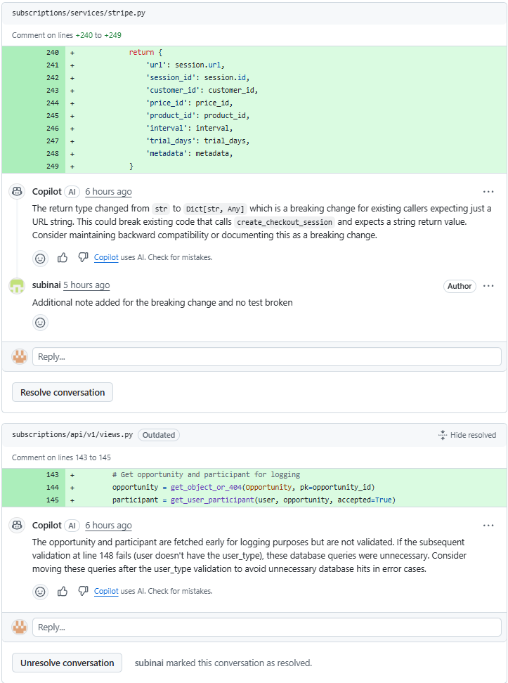
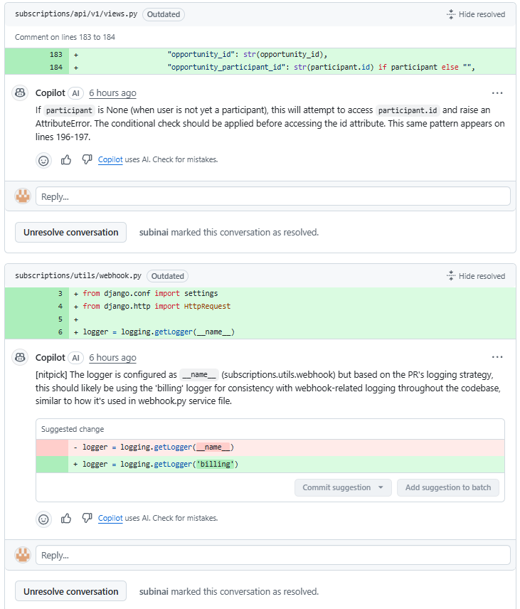
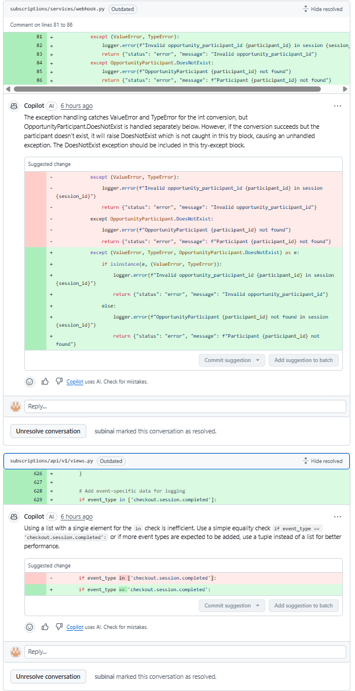

### Client Feedback
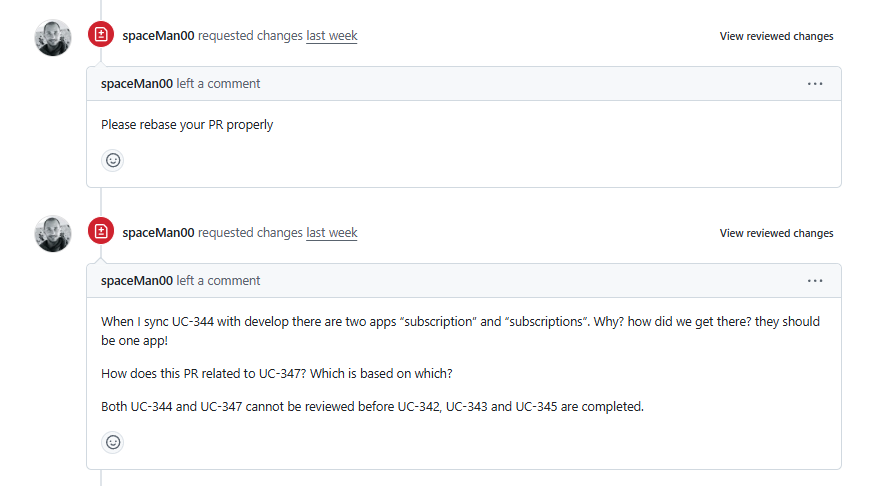

### Peer Review
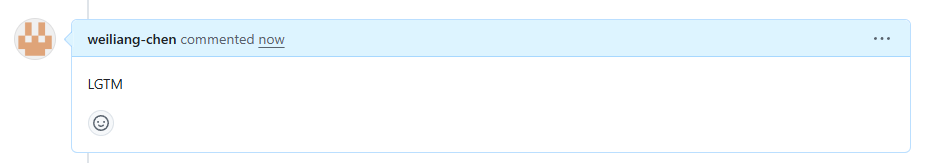

### Feedback Addressed
- Addressed most the Copilot feedbacks, remove unnessary comment, some of the feedbacks are invalid.
- According to the client's feedback, finalised the UC-344 after UC-345 and UC-343 are reviewd.

## Manual Review CheckList

1. Functionality
    - [x] The application runs without errors
    - [x] The implemented features complete the user story / meet the acceptance criteria
    - [x] Handles edge cases or invalid inputs
    - [x] No breaking changes introduces

2. Readability
    - [x] Code has clear and imformative comments
    - [x] Consistent with naming convertions
    - [x] Proper code structure and indentation
    - [x] No redundant code (instead use reusable functions)
    - [x] The code files are put into correct places to maintain a good structure of the codebase

3. Error Handling
    - [x] The input of the validation is check (null input is invalid if there is input)
    - [x] Appropriate error messages/status codes are returned/displayed
    - [x] All the errors are handled properly (will not cause the break down of the system)

4. Documentation
    - [x] The PR has clear message about what is implemented
    - [x] The status of the task board is updated

5. Testing
    - [x] Unit tested are added or updated
    - [x] Edge cases are convered in the tests
    - [x] All the tests return the expected results

## Backend : [PR-104](https://github.com/uniconnected/uniconnected-django/pull/104)

- **PR Title / ID**:    
  - UC-350: Notify users before subscription trial/renewal/expiry
- **Review Date**: 26/10/2025
- **Related User Story**: [US15]()
- **Repository**： uniconnected2-django
- **Area (frontend/backend)**: backend
- **Organiser**: William
- **Reviewers**: AI (Copilot), Bassam (client), David, Caitlin

## Code Review

### Summary:
This PR implement notification function that alerts users before their subscription trial, renewal, or expiry. It integrates Celery for scheduled notification sweeps, Stripe webhooks for real-time updates, and a robust email delivery pipeline with logging and deduplication.

| PR | Related User Story | File Name | Description | Status |
|----|---------|-------------|------------|------------|
|#104 | UC-350 | `uniconnected_backend/settings.py` | Added Celery configuration for scheduled notification tasks and email settings | Completed |
| |  | `uniconnected_backend/celery.py` | Initialized Celery app for async task queue processing | Completed |
| |  | `uniconnected_backend/urls.py` | Added subscriptions API routing with namespace | Completed |
| |  | `subscriptions/models.py` | Added `SubscriptionNoticeLog` model and `last_expiry_notified_at` field to Subscription | Completed |
| |  | `subscriptions/utils.py` | Implemented timezone and datetime utilities for scheduling | Completed |
| |  | `subscriptions/notifications.py` | Implemented email notification logic with recipient resolution and templating | Completed |
| |  | `subscriptions/tasks.py` | Created Celery tasks for both webhook-based and scheduled notifications | Completed |
| |  | `subscriptions/api/v1/views.py` | Added webhook and admin views for subscription and notification logs | Completed |
| |  | `subscriptions/api/v1/urls.py` | Added API routes for webhook and management endpoints | Completed |
| |  | `opportunities/management/commands/seed_demo_data.py` | Added demo subscription data for testing notification flows | Completed |
| |  | `docker-compose.yml` | Added Redis, Celery worker, and Celery beat containers for background jobs | Completed |

## Feedback engagement

### AI (copilot) Feedback
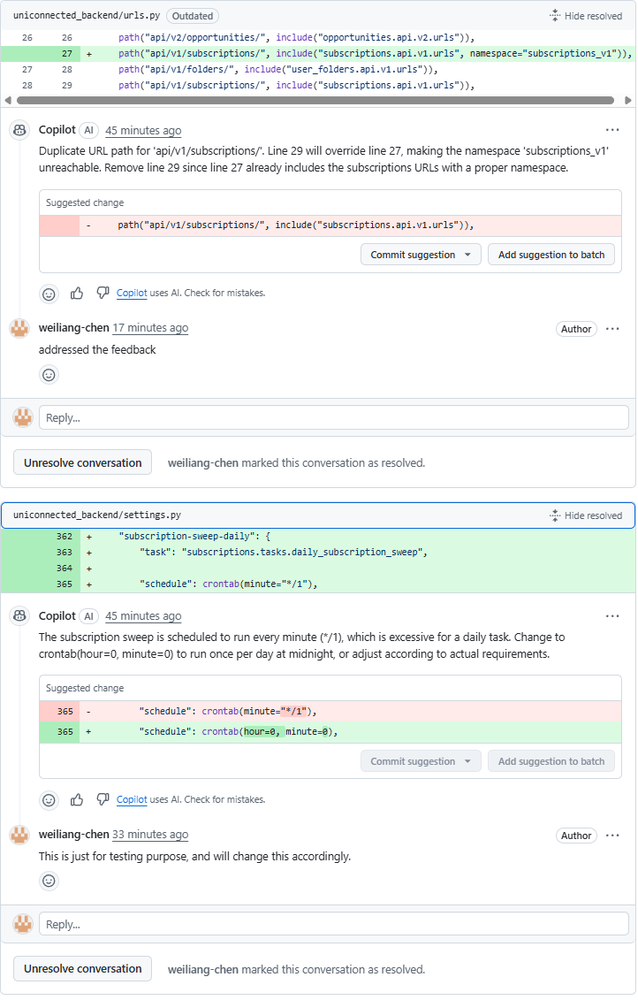
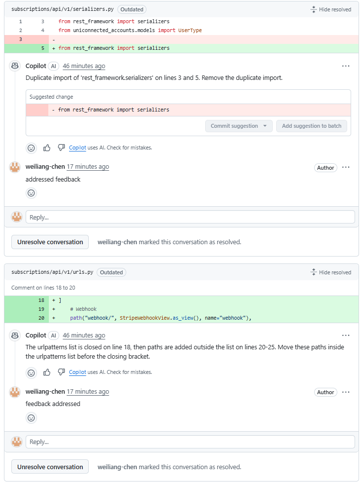
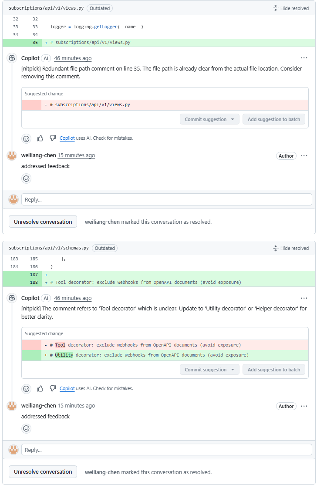

### Client Feedback
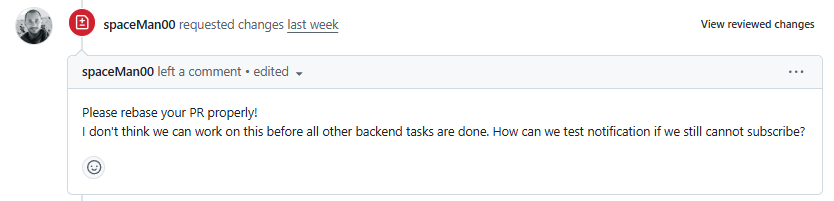

### Feedback Addressed
- Finalised the UC-350 after the other backend tasks are all done.
- Address most of the AI feedbacks, some feedbacks are unnecessary. 

## Manual Review CheckList

1. Functionality
    - [x] The application runs without errors
    - [x] The implemented features complete the user story / meet the acceptance criteria
    - [x] Handles edge cases or invalid inputs
    - [x] No breaking changes introduces

2. Readability
    - [x] Code has clear and imformative comments
    - [x] Consistent with naming convertions
    - [x] Proper code structure and indentation
    - [x] No redundant code (instead use reusable functions)
    - [x] The code files are put into correct places to maintain a good structure of the codebase

3. Error Handling
    - [x] The input of the validation is check (null input is invalid if there is input)
    - [x] Appropriate error messages/status codes are returned/displayed
    - [x] All the errors are handled properly (will not cause the break down of the system)

4. Documentation
    - [x] The PR has clear message about what is implemented
    - [x] The status of the task board is updated

5. Testing
    - [x] Unit tested are added or updated
    - [ ] Edge cases are covered in the tests
    - [ ] All the tests return the expected results

## Sprint 3 Lessons learned
- Copilot feedback will make suggestion on functionalities and documentation, but it is not always correct, critical thinking is needed to review the AI feedback before taking them.
- Always test before opening a PR.
- Be careful with the rebase, especially when mutiple people are working on the same epic but different features.
- Dependency mapping within and across the teams are particularly important before implementation. As people's capacity can be redistributed or spread across different team members. 
- Code review with each other within the team not only helps to improve the code quality, but also allows everyone to be familiar with their dependencies. 