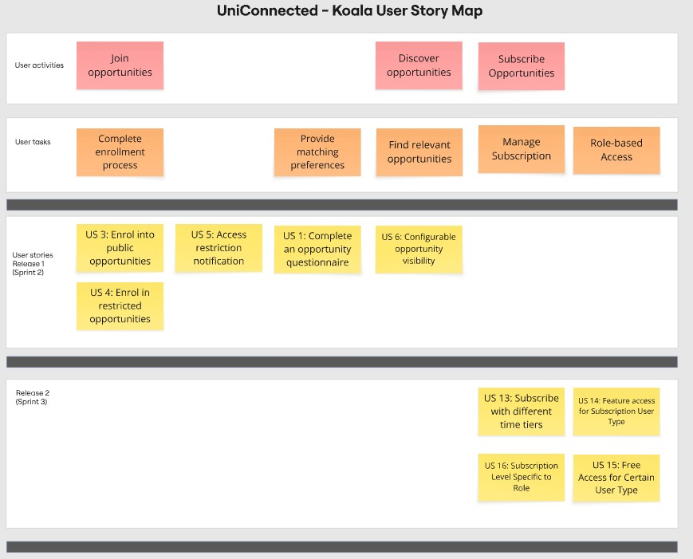

# User story

- [User story overview](#user-story-overview)
- [Detailed user stories](#detailed-user-stories)
  - [Epic 1: Employment opportunity and questionnaire](#epic-1-employment-opportunity-and-questionnaire-1)
    - [User story ID: US1](#user-story-id-us1)
    - [User story ID: US2](#user-story-id-us2)
  - [Epic 2: Open-enrollment into opportunity](#epic-2-open-enrollment-into-opportunity-1)
    - [User story ID: US3](#user-story-id-us3)
    - [User story ID: US4](#user-story-id-us4)
    - [User story ID: US5](#user-story-id-us5)
    - [User story ID: US6](#user-story-id-us6)
    - [User story ID: US7](#user-story-id-us7)
    - [User story ID: US8](#user-story-id-us8)
    - [User story ID: US9](#user-story-id-us9)
    - [User story ID: US10](#user-story-id-us10)
    - [User story ID: US11](#user-story-id-us11)
    - [User story ID: US12](#user-story-id-us12)
  - [Epic 3: Opportunity subscription](#epic-3-opportunity-subscription-1)
    - [User story ID: US13](#user-story-id-us13)
    - [User story ID: US14](#user-story-id-us14)
    - [User story ID: US15](#user-story-id-us15)
    - [User story ID: US16](#user-story-id-us16)
- [User story map](#user-story-map)

## User story overview
Note that these are an overview, and there may be slight deviations with the detailed user stories for brevity. 

### Epic 1: Employment opportunity and questionnaire

| ID  | As a... | I want to... | So that... | Priority | Estimation | Status |
|----|---------|-------------|------------|----------|--------|--------|
| [US1](#user-story-id-us1) | student | complete an employment questionnaire | I can receive relevant matches | High | 8 | Completed |
| [US2](#user-story-id-us2) | student or industry partner | update my opportunity questionnaire | I can keep my preferences updated | Low | 3 | Transferred |

### Epic 2: Open-enrollment into opportunity

| ID  | As a... | I want to... | So that... | Priority | Estimation | Status |
|----|---------|-------------|------------|----------|--------|--------|
| [US3](#user-story-id-us3) | student or industry partner | enrol into public opportunities | I can connect with potential matches | High | 5 | Completed |
| [US4](#user-story-id-us4) | student with partner university email | enrol in restricted opportunities | I can access exclusive opportunities to my university | High | 3 | Completed |
| [US5](#user-story-id-us5) | student with non-partner university email | be informed when I cannot access restricted opportunities | I can understand why access is restricted | Medium | 2 | Completed |
| [US6](#user-story-id-us6) | admin | mark an opportunity as public | the opportunity is discoverable by students or industry partners  | Medium | 8 | Completed |
| [US7](#user-story-id-us7) | student or industry partner | view a list of all opportunities I've enrolled in | I can keep track of all my opportunities and their status | High | 13 | Transferred |
| [US8](#user-story-id-us8) | student or industry partner | control my visibility in an opportunity | I can decide when I'm open to being contacted | Medium | 3 | Cancelled |
| [US9](#user-story-id-us9) | student or industry partner | see a description of the opportunity before enrolling | I can choose opportunities that align with my goals | Medium | 5 | Transferred |
| [US10](#user-story-id-us10) | student or industry partner | un-enrol from opportunities | I'm no longer discoverable and my current opportunities reflect my interests | High | 3 | Transferred |
| [US11](#user-story-id-us11) | student or industry partner | view potential matches sorted by distance | geographically convenient matches appear to me first | Medium | 5 |  Cancelled |
| [US12](#user-story-id-us12) | student or industry partner | view the distance between each potential match | I understand why certain matches are ranked higher | Low | 3 | Cancelled |

### Epic 3: Opportunity subscription
| ID  | As a... | I want to... | So that... | Priority | Estimation | Status |
|----|---------|-------------|------------|----------|--------|--------|
| [US13](#user-story-id-us13) | user | subscribe to a certain opportunity and I would like to have a monthly vs yearly tiers | I can choose the payment frequency that suits me | High | 13 | Completed |
| [US14](#user-story-id-us14) | certain user type | have a different subscription level than other user types | I can access features and pricing based on my role | High | 8 | Completed |
| [US15](#user-story-id-us15) | certain user type | have free access to a certain opportunity | I can participate without cost if eligible | Medium | 2 | Completed |
| [US16](#user-story-id-us16) | user | have a subscription level specific to my role | the pricing and features are appropriate for me | High | 5 | Completed |

## Detailed user stories

### Epic 1: Employment opportunity and questionnaire

#### User story ID: US1
- **Title:** Create Employment Questionnaire
- **As a** student, **I want to** complete an employment questionnaire (i.e., job type, duration, sector, preferences), **so that** I can receive relevant matches.
- **Priority:** High
- **Status:** Completed
- **Estimation:** 8
- **Justification:**
  - Priority: This is critical user story because the user need to compelte a questionnaire before enrol into a opportunity. Without it implemente , students cannot be matched with relevant opportunities.
  - Estimation: 8 points. It involves several frontend tasks, include start page, fill questionaire page, review page and finish page. Also need backend to create and store the questionnaire data. The complexity is relative high on this task.   
- **Acceptance Criteria:**
  - Given I am a student enrolling into the employment opportunity for the first time, when I click 'enrol', then I should be redirected to the employment questionnaire. 
  - Given I am a student enrolling into an opportunity, when I access the questionnaire, then I see a single-page form with fields: job type, duration, sector, preferences.
  - Given I am a student who has filled out the questionnaire, when I click 'next', I can see a page with my responses before I submit. 
  - Given I am a student enrolling into an opportunity, when I submit a valid questionnaire response, then my data should be stored in JSON format in the backend.
  - Given I am a student enrolling into an opportunity, when I submit the employment questionnaire, then I should be redirected to the employment opportunity. 
- [Project Board tickets](https://github.com/orgs/COMP90082-2025-sem2/projects/43/views/1?pane=issue&itemId=126616352&issue=COMP90082-2025-sem2%7CUC-Koala%7C38)

#### User story ID: US2
- **Title:** Update Questionnaire and Opportunity-Specific Information
- **As a** student, **I want to** update my opportunity questionnaire, **so that** I can keep my preferences up-to-date.
- **Priority:** Low
- **Status:** Transferred
- **Estimation:** 3
- **Justification:**
  - Priority: This task is in medium priority, not as critical as initial questionnaire creation. Compared to other features, this user story will be placed in the bottom priority.
  - Estimation: It should be less complex than user story 1. The logic is to update a existing questionaire response so can resue the existing questionaire model. Though need to create frontend pages to allow update. This will be a task around small and medium size.
- **Acceptance Criteria:**
  - Given I am a student who has completed a questionnaire, when I access my profile, then I should see an option to edit my response.
  - Given I am a student updating my questionnaire, when I save it, then I should see a confirmation and the updated response in my profile. 
  - Given I am a student who has updated my questionnaire, when a potential employer filters their matches, then my updated responses should be reflected in the match filtering.
- [Project Board tickets](https://github.com/orgs/COMP90082-2025-sem2/projects/43/views/1?pane=issue&itemId=126616317&issue=COMP90082-2025-sem2%7CUC-Koala%7C41)

### Epic 2: Open-enrollment into opportunity

#### User story ID: US3
- **Title:** Opportunity Enrolment
- **As a** student or industry partner, **I want to** enrol in public opportunities (or private ones that I have been invited to) that interest me, **so that** I can connect with potential matches and participate in the program. 
- **Priority:** High
- **Status:** Completed
- **Estimation:** 5
- **Justification:**
  - Priority: This is one of the essential functionality of the platform. 
  - Estimation: Most of the frontend work will be handled by questionaire tasks, student user will automaticaly enrol in a opportunity after finish a questionaire. However, the opportunity enrol will involve extra validation logic for validation. Hence 5 points is given here.
- **Acceptance Criteria:**
  - Given I am a student viewing a public opportunity, when I click 'enrol', then I should be redirected to complete the questionnaire. 
  - Given I am a student or industry partner successfully enrolled in an opportunity, when I view it again, then I should see my enrolment status instead of an 'enrol' button.
  - Given I am a student or industry partner enrolled in an opportunity, when other participants view matches, then I should appear on their potential match list.
- [Project Board tickets](https://github.com/orgs/COMP90082-2025-sem2/projects/43/views/1?pane=issue&itemId=126616352&issue=COMP90082-2025-sem2%7CUC-Koala%7C38)

#### User story ID: US4
- **Title:** Partner University Student Enrolment
- **As a** student with a partner university email, **I want to** enrol into university-restricted opportunities, **so that** I can access exclusive opportunities for my university.
- **Priority:** High
- **Status:** Completed
- **Estimation:** 3
- **Justification:**
  - Priority: High, since it is also one of the essential functionality of the platform. Student from partner university should able to access restricted opportunities.
  - Estimation: The task of this user story would be relative small. Need to introduce an extra field in opportunity model and logic to validate student during their enrolments.
- **Acceptance Criteria:**
  - Given I am a student with a partner university email domain, when I attempt to enrol, then I should be granted access to the opportunity.
- [Project Board tickets](https://github.com/orgs/COMP90082-2025-sem2/projects/43/views/1?pane=issue&itemId=126616426&issue=COMP90082-2025-sem2%7CUC-Koala%7C39)

#### User story ID: US5
- **Title:** Non-Partner Student University Enrolment
- **As a** student with a non-partner university email, **I want to** be informed when I cannot access partner-specific opportunities, **so that** I understand why access is restricted.
- **Priority:** Medium
- **Status:** Completed
- **Estimation:** 2
- **Justification:**
  - Priority: This is not an essential feature, but an important feature to improve user experience for studnet from non-partent university.
  - Estimation: For this user story only involve client-side (frontend) tasks. Not too much components need to be implmented.
- **Acceptance Criteria:**
  - Given I am a student with a non-partner university email domain, when I attempt to enrol, then I can see a clear message explaining the access restriction and possible further options.
- [Project Board tickets](https://github.com/orgs/COMP90082-2025-sem2/projects/43/views/1?pane=issue&itemId=126616566&issue=COMP90082-2025-sem2%7CUC-Koala%7C40)

#### User story ID: US6
- **Title:** Opportunity Visibility
- **As an** admin user, **I want to** mark my opportunity as public, **so that** I can have my opportunity be discoverable by students or industry partners.
- **Priority:** High
- **Status:** Completed
- **Estimation:** 8
- **Justification:**
  - Priority: This is an important user story, as we don't want to make every opportunity is private. The student from non-partner university should able to view and join in some public opportunities.
  - Estimation: This user story involves several tasks, including modify current opportunity model, create CRUD api for participant (in v2 version), and replace the deprecate v1 apis from frontend. Integration and testing add to the effort. We consider this will be a large complexity user story.
- **Acceptance Criteria:**
  - Given I am an admin or coordinator creating an opportunity, when I configure it, then I have an option to set it as public or invite-only.
  - Given I an admin or coordinator who has set my opportunity as public, when users go to the Discover dropdown, then it should appear in the discoverable list. 
  - Given I an admin or coordinator who has set my opportunity as invite-only, when non-invited users go to the Discover dropdown, then it should not appear in the discoverable list. 
- [Project Board tickets](https://github.com/orgs/COMP90082-2025-sem2/projects/43/views/1?pane=issue&itemId=126616277&issue=COMP90082-2025-sem2%7CUC-Koala%7C36)

#### User story ID: US7
- **Title:** Viewing Enrolled Opportunities
- **As a** student or industry partner, **I want to** view a list of all opportunities I’ve enrolled in from my user profile, **so that** I can keep track of my opportunities and their statuses (e.g., enrolled, expired, cancelled).
- **Priority:** High
- **Status:** Transferred 
- **Estimation:** 13
- **Justification:**
  - Priority: Students and industry partners must be able to view all opportunities they have enrolled in. This feature is essential for tracking progress and managing participation (e.g., distinguishing between active, expired, or cancelled opportunities). Without this functionality, users may lose visibility of their commitments and status
  - Estimation:  Requires implementing backend queries to fetch all opportunities linked to a user, categorising them by status (enrolled, expired, cancelled), and displaying them in the user profile. Additionally, frontend work is needed to design separate sections and enable expansion for questionnaire responses. Overall it is considered as a large task
- **Acceptance Criteria:**
  - Given I am a student or industry partner who is enrolled in some opportunity, when I access my profile, then I should see a "Current Opportunities" section listing all my enrolled opportunities.
  - Given I am a student or industry partner, when I un-enrol from an opportunity, then I can see it in the "Cancelled Opportunities" section of my profile. 
  - Given I am a student or industry partner, when an opportunity that I was enrolled in has expired, then I can see it in the "Cancelled Opportunities" section of my profile.
  - Given I am a student with some enrolled opportunities, when I access my profile, then I can see the opportunity details (e.g., name and organiser) and an option to expand to see my questionnaire response. 
- [Project Board tickets](https://github.com/orgs/COMP90082-2025-sem2/projects/43/views/1?pane=issue&itemId=126616590&issue=COMP90082-2025-sem2%7CUC-Koala%7C42)

#### User story ID: US8
- **Title:** Participant Visibility
- **As a** student or industry partner, **I want to** control my visibility in a specific opportunity, **so that** I can decide when I'm open to being contacted without needing to un-enrol. 
- **Priority:** Medium
- **Status:** Cancelled
- **Estimation:** 3
- **Justification:**
  - Priority: Visibility control is important for user autonomy and privacy, but not as critical as other core features like enrolment and opportunity tracking 
  - Estimation: The implementation mainly requires adding a visibility field to the participant model. Some minor update on the frortend UI, and ensure backend filtering logic compromise with the visibility. 
- **Acceptance Criteria:**
  - Given I am a student or industry partner enrolled in an opportunity, when I view my profile, then I can see an option to toggle the visibility status per opportunity. 
  - Given I am a student or industry partner with my visibility set to private, when other participants browse their matches, then my profile should not appear. 
  - Given I am a student or industry partner, when I change my visibility status and save, then the change should be reflected immediately to other participants. 
- [Project Board tickets](https://github.com/orgs/COMP90082-2025-sem2/projects/43/views/1?pane=issue&itemId=126616601&issue=COMP90082-2025-sem2%7CUC-Koala%7C43)

#### User story ID: US9
- **Title:** Opportunity Description Page
- **As a** student or industry partner, **I want to** see a description of the opportunity before enrolling, **so that** I can choose opportunities that align with my goals.
- **Priority:** Medium
- **Status:** Transferred 
- **Estimation:** 5
- **Justification:**
  - Priority: Having a opportunity description is important to allow users to understand the details before enrolling. However it is secondary to the core features hence it has a medium priority.
  - Estimation: Requires creating a dedicated opportunity description page in frontend, implementation and integration with the backend API. Testing is required to ensure correct rendering.
- **Acceptance Criteria:**
  - Given I am a student or industry partner, when I select an opportunity that I'm not already enrolled in, then I see a description page for the opportunity with any restrictions.
- [Project Board tickets](https://github.com/orgs/COMP90082-2025-sem2/projects/43/views/1?pane=issue&itemId=126616612&issue=COMP90082-2025-sem2%7CUC-Koala%7C44)

#### User story ID: US10
- **Title:** Cancel Enrollment
- **As a** student or industry partner, **I want to** un-enroll from opportunities, **so that** I'm no longer discoverable and my current opportunities reflects my interests.
- **Priority:** High
- **Status:** Completed
- **Estimation:** 3
- **Justification:**
  - Priority: The ability to cancel enrolments is essential for both students and industry partners to manage their commitments. Ensuring users have control over their pariticipant is a critical part of the platform’s usability
  - Estimation: Implementation primarily requires adding a cancel button on the frontend, confirmation modal and backend api to update paritipant status. 
- **Acceptance Criteria:**
    - Given I am a student or industry partner, when I view my profile, then I can see an option to 'Cancel' next to each opportunity I am enrolled in. 
    - Given I am a student or industry partner viewing my enrolled opportunities, when I click 'cancel' on an opportunity, then a modal should pop up to confirm my choice. 
   - Given I am a student or industry partner, when I confirm cancellation of an opportunity, then it moves to the "Cancelled Opportunities" section of my profile. 
   - Given I am a student or industry partner, when I view "Cancelled Opportunities" on my profile, then I see an option to 're-enrol' directly if I'm still eligible. 
    - Given I am a student or industry partner enrolled in an opportunity, when I un-enrol, then I should be removed from the participant matches immediately. 
    - Given I am a student un-enrolled in the employment opportunity, when I want to re-enrol, then I am redirected to the employment questionnaire to complete again.
- [Project Board tickets](https://github.com/orgs/COMP90082-2025-sem2/projects/43/views/1?pane=issue&itemId=126616618&issue=COMP90082-2025-sem2%7CUC-Koala%7C45)

#### User story ID: US11
- **Title:** Automatic Distance-Based Sorting
- **As a** student or industry partner, **I want to** have my potential matches sorted by distance (ascending), **so that** the most geographically convenient matches appear first.
- **Priority:** Medium
- **Status:** Cancelled
- **Estimation:** 5
- **Justification:**
  - Priority: This feature will allow the user to view matches by distance, providing convenience and user experience, especially for location sensitive or need to in person paricipant opportunities. However, this will be an additional feature hence will have medium priority.
  - Estimation: Requires implementing geolocation logic (e.g., storing user addresses, calculating distances), integrating with backend queries for sorting, and updating the frontend to display matches in order of proximity. Additional frontend work might need to be done to allow user to update their location settings.
- **Acceptance Criteria:**
  - Given I am a student or industry partner viewing my matches, when the matches load, then they should be automatically sorted based on proximity to my location (i.e., nearest first). 
  - Given I am a student or industry partner, when I navigate to my profile, then I can update my location settings if I need to change my current address. 
- [Project Board tickets](https://github.com/orgs/COMP90082-2025-sem2/projects/43/views/1?pane=issue&itemId=126616672&issue=COMP90082-2025-sem2%7CUC-Koala%7C46)

#### User story ID: US12
- **Title:** Distance Information Display
- **As a** student or industry partner, **I want to** see the calculated distance to each potential match, **so that** I understand why certain matches are prioritised in the returned match rankings.
- **Priority:** Low
- **Status:** Cancelled
- **Estimation:** 3
- **Justification:**
  - Priority: Displaying the calculated distance will add transparency and user trust for the distance based sorting. However this feature has the lowest priority in all the features.
  - Estimation: Require to retrieve the calculated distance from the database, and rendering them in the frontend UI. Minimal backend work and testing are needed.
- **Acceptance Criteria:**
  - Given I am a student or industry partner, when I view my match results, then I can see the calculated distance shown to the nearest kilometre for each match.
- [Project Board tickets](https://github.com/orgs/COMP90082-2025-sem2/projects/43/views/1?pane=issue&itemId=126616689&issue=COMP90082-2025-sem2%7CUC-Koala%7C47)

### Epic 3: Opportunity Subscription

#### User story ID: US13
- **Title:** Subscribe with Monthly vs Yearly Tiers
- **As a** user, **I want to** be offered both monthly and yearly tiers, **so that** I can choose the payment frequency that suits my budget and commitment
- **Priority:** High
- **Status:** Completed
- **Estimation:** 13
- **Justification:**
    - Priority: Subscription tiers are core to the platform's revenue model and provide users with flexible payment options. High priority as a foundational subscription feature.
    - Estimation: Requires creating subscription models, implementing backend subscription logic, building checkout flow, and developing frontend UI for tier selection. Largest user story in Sprint 3.
- **Acceptance Criteria:**
  - Given I am a user viewing subscription options, when I access the subscription page, then I should see both monthly and yearly tier options with clear pricing
  - Given I am a user selecting a subscription, when I complete checkout, then my subscription type (monthly/yearly) should be stored in the backend
  - Given I am a user with an active subscription, when my billing cycle ends, then I should be charged according to my chosen plan (monthly or yearly).
  - Given I am a user, when I view my subscription details, then I should see the billing cycle (monthly or yearly) clearly displayed
- [Project Board tickets](https://github.com/orgs/COMP90082-2025-sem2/projects/43/views/10?pane=issue&itemId=131054761&issue=COMP90082-2025-sem2%7CUC-Koala%7C68)

#### User story ID: US14
- **Title:** Feature access for Subscription User Type
- **As a** user, **I want** different subscription features based on my role, **so that** I only pay for relevant functionality and can access features and pricing appropriate for my user type
- **Priority:** High
- **Status:** Completed
- **Estimation:** 8
- **Justification:**
    - Priority: Different user types may require distinct feature sets and pricing models for fair pricing and appropriate feature access.
    - Estimation: Requires extending subscription model for role differentiation, implementing role-specific access logic, and building role-aware subscription UI. Medium-sized task.
- **Acceptance Criteria:**
  - Given I am a specific user type, when I view subscription options, then I should only see tiers applicable to my role
  - Given I am subscribing as a student, when I select a tier, then I should be assigned student-specific features and pricing (i.e., free tier for public opportunities) 
  - Given I am subscribing as an organisation, when I select a tier, then I should be assigned organisation-specific features and pricing (i.e., paid tier for public opportunities)
  - Given I am a subscribed user, when I access platform features, then the system should enforce role-based subscription restrictions
- [Project Board tickets](https://github.com/orgs/COMP90082-2025-sem2/projects/43/views/10?pane=issue&itemId=131054892&issue=COMP90082-2025-sem2%7CUC-Koala%7C69)

#### User story ID: US15
- **Title:** Free Access for Certain User Type
- **As a** eligible user, **I want** free access to certain opportunities, **so that** I can participate without subscription barriers
- **Priority:** Medium
- **Status:** Completed
- **Estimation:** 2
- **Justification:**
    - Priority: Supports university partnership model but not critical for core subscription functionality. Medium priority to enable partner access.
    - Estimation: Minimal backend logic to validate eligibility and bypass subscription checks. Small task.
- **Acceptance Criteria:**
    - Given I am a user eligible for free access, when I attempt to enrol in opportunities, then I should not be prompted for subscription payment
    - Given I am an ineligible user, when I attempt to access restricted features, then I should be prompted to subscribe
- [Project Board tickets](https://github.com/orgs/COMP90082-2025-sem2/projects/43/views/10?pane=issue&itemId=131054976&issue=COMP90082-2025-sem2%7CUC-Koala%7C70)

#### User story ID: US16
- **Title:** Free trial period
- **As a** new user, **I want** a free trial period, **so that** I can evaluate the platform before committing to a paid subscription
- **Priority:** High
- **Status:** Completed
- **Estimation:** 5
- **Justification:**
    - Priority: Free trials reduce barrier to entry and improve conversion rates. High priority for user acquisition strategy.
    - Estimation: Requires trial period logic in subscription model, trial activation on signup, expiry tracking, and frontend trial status display. Medium-sized task.
- **Acceptance Criteria:**
    - Given I am a new user, when I sign up, then I should automatically receive a free trial period
    - Given I am a trial user, when I access the platform, then I should see my trial end date clearly displayed
    - Given my trial expires, when I access the platform, then I should be prompted to select a paid subscription tier
    - Given I am a trial user, when I subscribe to a paid tier, then my trial should end and paid subscription should begin immediately
- [Project Board tickets](https://github.com/orgs/COMP90082-2025-sem2/projects/43/views/10?pane=issue&itemId=131055071&issue=COMP90082-2025-sem2%7CUC-Koala%7C71)

## User story map

