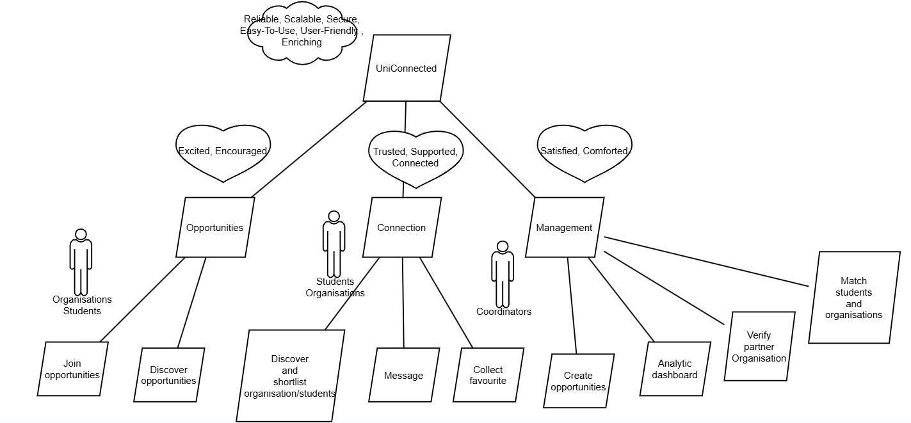

# Do-Be-Feel and Motivational Model  

## **Who**  
- Current university students
- Recently graduated university students
- Industry partners
- University program coordinators

## **Do**  

**For student users:**  
 - Register and verify using their university email.  
 - Discover opportunities in the Employment Opportunity module.  
 - Join opportunities based on interests, skills, or availability.  
 - Connect and communicate with industry partners.  
 - Collect favourite organisations in a folder.  

**For industry users:**
 - Discover students in the Employment Opportunity module  
 - Discover different potential candidates pools based on subscription level.   
 - Review and shortlist students based on skills, availability, university etc.   
 - Connect and communicate with students and potential candidates.  
 - Save favourite candidates in a folder.  

**For coordinator users:**
 - Create opportunities for students and industry partners to make connection.  
 - Invite students to join the created opportunity (e.g., private) on the platform.  
 - Match connection between students and industry partners.  
 - View match statistics in a dashboard.  

## **Be**  
 - Secure and reliable registration and authentication for both students and industry partners.  
 - Clear and accurate information to help student and partner onboarding.  
 - User-friendly interface for filtering and making matches between students and industry partners.  
 - Reliable communication between industry partners and students.  
 - Scalable and able to accomodate diverse users and opportunities in future expansion.  
 - Supports secure data and privacy protection.  

## **Feel**  

**For student users:**
 - Excited to discover new opportunities.  
 - Confident to join opportunities and reach out to organisations.    
 - Flexible to join opportunities based on availability.      
 - Trust the platform to keep their data safe.   

**For industry users:**
 - Excited to discover new student talent and reach out to potential candidates.  
 - Supported to find and shortlist potential candidates.    
 - Confident to connect with verified and qualified students.  

**For coordinator users:**
 - Supported to create new opportunities by user-friendly interface.  
 - Informed when accessing the analytic data.  
 - Assured to use the secure and reliable system.  

## **Motivational Model**  

